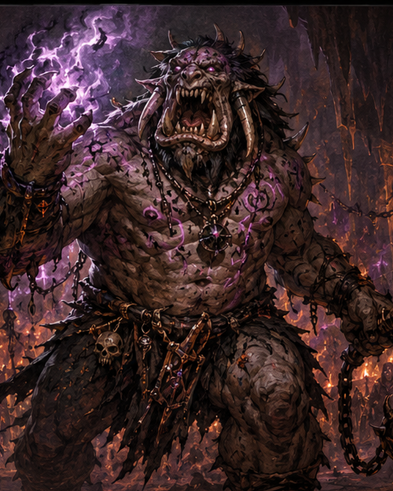

# Abraxas Cult Leader

A hulking troll-like hierophant transformed by prolonged communion with Abraxas. Massive tusk-like fangs jut from a wide mouth, ritual scars crawl across their flesh, and violence sends them into visible ecstasy.

FAST PLAYOpening: Stay near the ritual and use Cry of Ruin early when several cultists can act meaningfully, forcing divided attention.

Default: Use Rending Fists on one nearby target and gain Fear through Momentum. Use Chaotic Flux when multiple PCs cluster.

When Hit Hard: Use Violence Is Revelation to reposition toward the ritual, vulnerable prey, or a disruptive location.

Spend Fear: Use Gift of the Threshold primarily to break formations or displace PCs from objectives; damage is secondary.

If Allies Thin: Stop investing Stress in Cry of Ruin and shift toward direct bruiser and control play.

Goal: Conduct a chaotic battle through followers, Fear, and forced movement instead of becoming a stationary sack of HP.

<table class="stat-table">
  <thead><tr><th>Attribute</th><th align="right">Value</th></tr></thead>
  <tbody>
    <tr><td>Tier</td><td align="right">2</td></tr>
    <tr><td>Role</td><td align="right">Leader</td></tr>
    <tr><td>Difficulty</td><td align="right">16</td></tr>
    <tr><td>Damage Thresholds</td><td align="right">13 / 25</td></tr>
    <tr><td>Hit Points</td><td align="right">8</td></tr>
    <tr><td>Stress</td><td align="right">5</td></tr>
  </tbody>
</table>

## Attack

| Attack | Modifier | Range | Damage |
|---|---:|---|---|
| Rending Fists | +4 | Melee | d8+5 Physical |

## Experiences
- **Intimidation +3**
- **Ritual Lore +3**

## Motives & Tactics
break order, revel in violence, drive followers into frenzy, protect the ritual, hurl enemies through warped space

## Features
### Momentum

When the Cult Leader makes a successful attack against a PC, you gain a Fear.

### Cry of Ruin

Mark a Stress to spotlight up to 1d4+1 Cult of the Eternal Night allies within Far range. Attacks they make while spotlighted this way deal half damage.

### Chaotic Flux

Make an attack against up to three targets within Very Close range. Mark a Stress to deal 2d8+4 magic damage to each target the Cult Leader succeeds against.

### Violence Is Revelation

When the Cult Leader marks 2 or more HP from a single attack, they can immediately move anywhere within Close range, smashing through creatures and terrain in their path. Every target they pass within Melee range of must make a Strength Reaction Roll (16). On a failure, they take 2d6+5 physical damage and are knocked back to Very Close range. On a success, they take half damage and aren’t moved.

### Gift of the Threshold

Spend a Fear and choose a point within Far range. Reality buckles in a Very Close area around that point. All creatures there must make an Instinct Reaction Roll (16). On a failure, they take 2d8+3 magic damage and the GM moves them anywhere within Very Close range of their original position. On a success, they take half damage and aren’t moved.

---

adversaries/Adversaries/Tier 2

