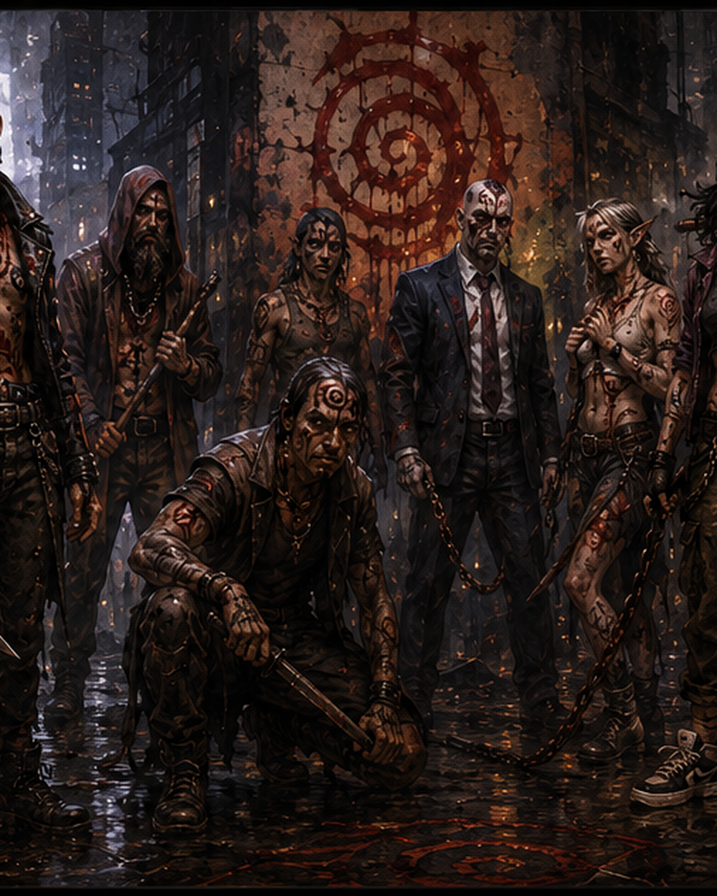

# Abraxas Cultist

A recognizably ordinary Seattle resident whose clothing and manner still reflect their former life, but whose flesh bears ritual cuts, deliberate mutilations, and the spiraling mark of Abraxas.

FAST PLAYOpening: Stay close to other cultists and put bodies between the PCs and the ritual or other objective.

Default: Use Street Weapons against a target another cultist already threatens so Frenzy of the Faithful can replace normal damage.

Pressure: Use Threshold Spasm when two PCs cluster or when its small forced movement will disrupt position, cover, or access to an objective.

When Hurt: After marking Major or greater damage, use Pain Is the Door when the Stress cost is worth gaining Fear.

Goal: Make ordinary cultists dangerous through fanaticism and proximity; PCs should benefit from breaking up the group.

<table class="stat-table">
  <thead><tr><th>Attribute</th><th align="right">Value</th></tr></thead>
  <tbody>
    <tr><td>Tier</td><td align="right">1</td></tr>
    <tr><td>Role</td><td align="right">Standard</td></tr>
    <tr><td>Difficulty</td><td align="right">12</td></tr>
    <tr><td>Damage Thresholds</td><td align="right">6 / 12</td></tr>
    <tr><td>Hit Points</td><td align="right">5</td></tr>
    <tr><td>Stress</td><td align="right">3</td></tr>
  </tbody>
</table>

## Attack

| Attack | Modifier | Range | Damage |
|---|---:|---|---|
| Street Weapons | +1 | Very Close | d8+1 Physical |

## Experiences
- **Streetwise +2**
- **Fanatical Devotion +2**

## Motives & Tactics
embrace pain, overwhelm together, protect the ritual, spread chaos, prove devotion

## Features
### Frenzy of the Faithful

When the Cultist makes a successful standard attack and another Abraxas Cultist is within Melee range of the target, deal 1d8+5 physical damage instead of their standard damage.

### Threshold Spasm

Mark a Stress to channel a brief eruption of Abraxas through the Cultist's mutilated flesh. Make an attack against up to two targets within Very Close range. Targets the Cultist succeeds against take 1d6+3 magic damage, and the GM may move each target to another position within Melee range of their original position.

### Pain Is the Door

When the Cultist marks Major or greater damage, you can mark a Stress to gain a Fear.

---

adversaries/Adversaries/Tier 1

