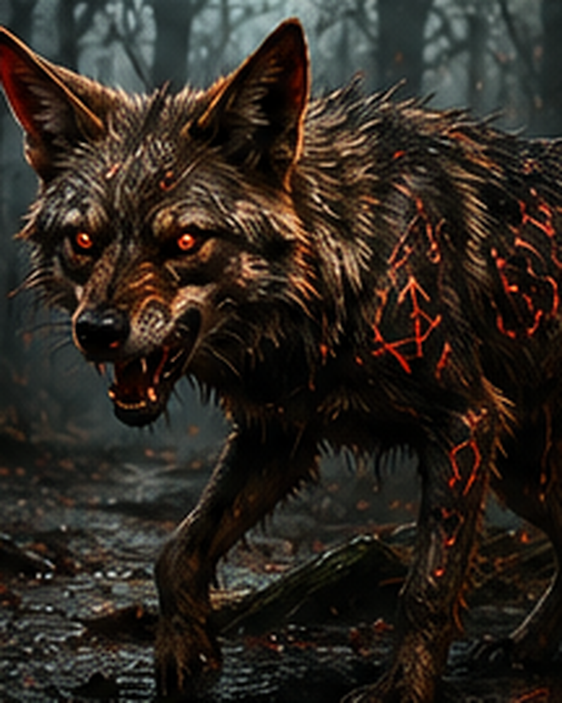

# Altered Coyote

A lean Cascade coyote marked by subtle Abraxan ritual corruption, hunting with an eerie collective intelligence that makes a gathering pack far more dangerous than any individual animal.

FAST PLAYOpening: Spread out to encircle the party. Identify an isolated or exposed PC as immediate prey.

Default: Bite the chosen target after establishing Pack Tactics whenever possible; the pack is intentionally weaker when isolated.

Reposition: Use Shared Nervous System when the Stress spend will establish or preserve Pack Tactics, close an escape route, or reform the surround.

Pressure: Concentrate on isolated prey. If PCs break formation, reform the surround instead of fighting as scattered individuals.

Remember: Pack Tactics replaces normal Bite damage. Its highest tier requires three other Coyotes; Shared Nervous System grants movement only.

Goal: Make formation the pack's danger and reward PCs who separate, shove, restrain, scatter, or remove individual Coyotes.

<table class="stat-table">
  <thead><tr><th>Attribute</th><th align="right">Value</th></tr></thead>
  <tbody>
    <tr><td>Tier</td><td align="right">1</td></tr>
    <tr><td>Role</td><td align="right">Standard</td></tr>
    <tr><td>Difficulty</td><td align="right">12</td></tr>
    <tr><td>Damage Thresholds</td><td align="right">5 / 10</td></tr>
    <tr><td>Hit Points</td><td align="right">4</td></tr>
    <tr><td>Stress</td><td align="right">2</td></tr>
  </tbody>
</table>

## Attack

| Attack | Modifier | Range | Damage |
|---|---:|---|---|
| Bite | +1 | Melee | d6+2 Physical |

## Experiences
- **Pack Hunter +2**

## Motives & Tactics
encircle, isolate, flank, test defenses, overwhelm isolated prey, retreat and reform

## Features
### Pack Tactics

When the Altered Coyote succeeds on a standard attack and another Altered Coyote is within Melee range of the target, deal 1d8+3 physical damage instead of the standard damage. If three or more other Altered Coyotes are within Very Close range of the target, deal 1d8+5 physical damage instead.

### Shared Nervous System

Once per spotlight, when another Altered Coyote within Close range moves, this Coyote can mark a Stress to immediately move up to Close range. It does not gain an additional attack from this movement.

---

adversaries/Adversaries/Tier 1

