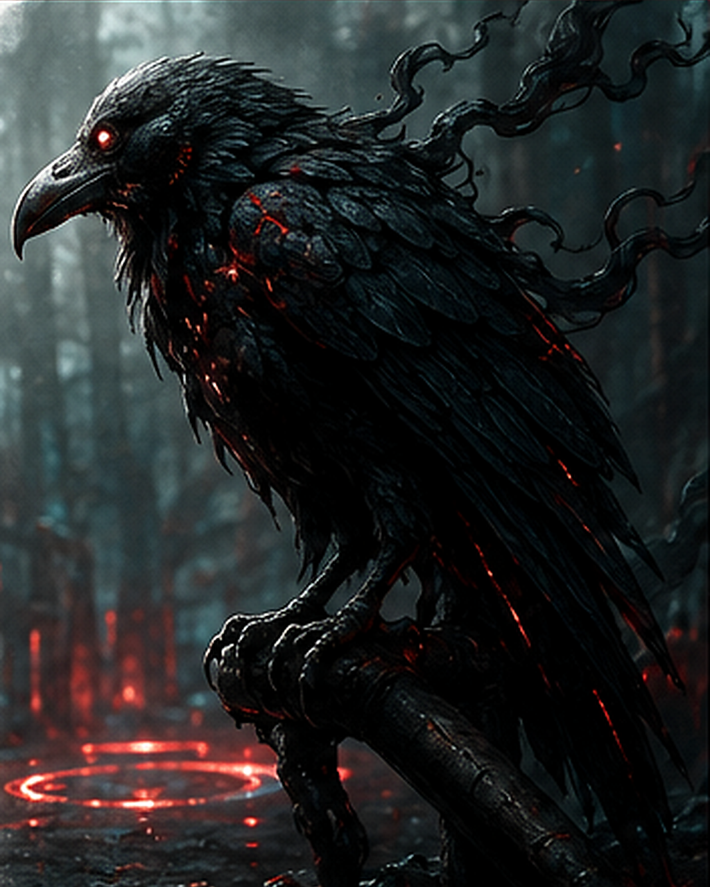

# Altered Raven

A Pacific Northwest raven warped by Abraxan ritual bleed, its black feathers traced with faint ember-red spiral corruption and its calls carrying impossible echoes of human voices.

FAST PLAYOpening: Stay flying and observe from above. Follow the PCs so they know they are being watched rather than starting a conventional fight.

Default: Shadow movement and stay out of reach. Attack directly only if cornered or fiction strongly demands it.

Pressure: Use Dread Chorus when psychological pressure matters, especially against a stressed or isolated target.

If Threatened: Flee direct confrontation; Ravens are scouts and warning signs, not committed melee attackers.

Remember: Flying adds +2 Difficulty. Minion (3) can remove additional nearby Ravens from one damaging attack.

Goal: Make the party feel observed and unsettled while signaling that something deeper in the valley is aware of them.

<table class="stat-table">
  <thead><tr><th>Attribute</th><th align="right">Value</th></tr></thead>
  <tbody>
    <tr><td>Tier</td><td align="right">1</td></tr>
    <tr><td>Role</td><td align="right">Minion</td></tr>
    <tr><td>Difficulty</td><td align="right">10</td></tr>
    <tr><td>Damage Thresholds</td><td align="right"> / </td></tr>
    <tr><td>Hit Points</td><td align="right">1</td></tr>
    <tr><td>Stress</td><td align="right">1</td></tr>
  </tbody>
</table>

## Attack

| Attack | Modifier | Range | Damage |
|---|---:|---|---|
| Beak & Talons | -4 | Melee | d4 Physical |

## Experiences
- **Keen Senses +3**

## Motives & Tactics
observe from above, follow intruders, unsettle, warn the cult, flee direct confrontation

## Features
### Minion (3)

The Altered Raven is defeated when it takes any damage. For every 3 damage a PC deals to the Raven, defeat an additional Altered Raven within range the attack would succeed against.

### Flying

While flying, the Altered Raven gains a +2 bonus to its Difficulty.

### Dread Chorus

Mark a Stress and choose a target within Close range who can hear the ravens. The target must make a Presence Reaction Roll (13). On a failure, they mark 2 Stress and become Vulnerable until the end of their next action.

---

adversaries/Adversaries/Tier 1

