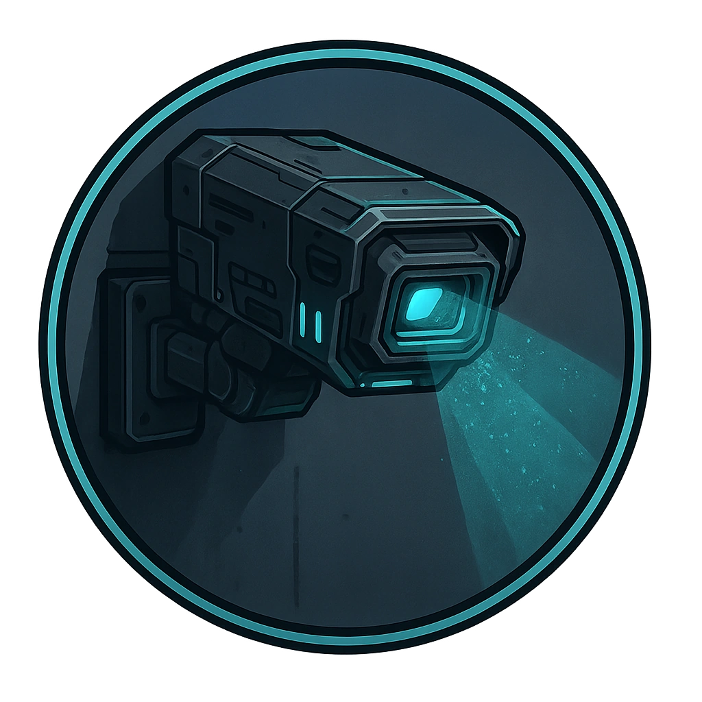

# AR Projector

A small projector that paints augmented reality overlays into local space.

<table class="stat-table">
  <thead><tr><th>Attribute</th><th align="right">Value</th></tr></thead>
  <tbody>
    <tr><td>Tier</td><td align="right">1</td></tr>
    <tr><td>Role</td><td align="right">Support</td></tr>
    <tr><td>Difficulty</td><td align="right">8</td></tr>
    <tr><td>Damage Thresholds</td><td align="right">2 / 5</td></tr>
    <tr><td>Hit Points</td><td align="right">1</td></tr>
    <tr><td>Stress</td><td align="right">0</td></tr>
  </tbody>
</table>

## Attack

| Attack | Modifier | Range | Damage |
|---|---:|---|---|
| No attack | +0 | Melee | d6 Physical |

## Experiences
- **Device Interaction +1**

## Motives & Tactics
project overlays; distract

## Features
—

## Notes
Device access levels:

Infiltrate actions:

Project Image

Create an AR image up to 10'x10'.  Any observer can percieve that it is AR with a Difficulty check of this device

Access logs

Access how this device was used recently

Enable or Disable

Turn the device on or off

Control actions:

Blinding Flash

Any creature facing this device must make a Reaction check agains this device's Difficulty or be blinded

Detonate

d4 damage to all creatures within Very Close. Make a Reaction check against this device's Difficulty to take half damage.

---

adversaries/Common devices

