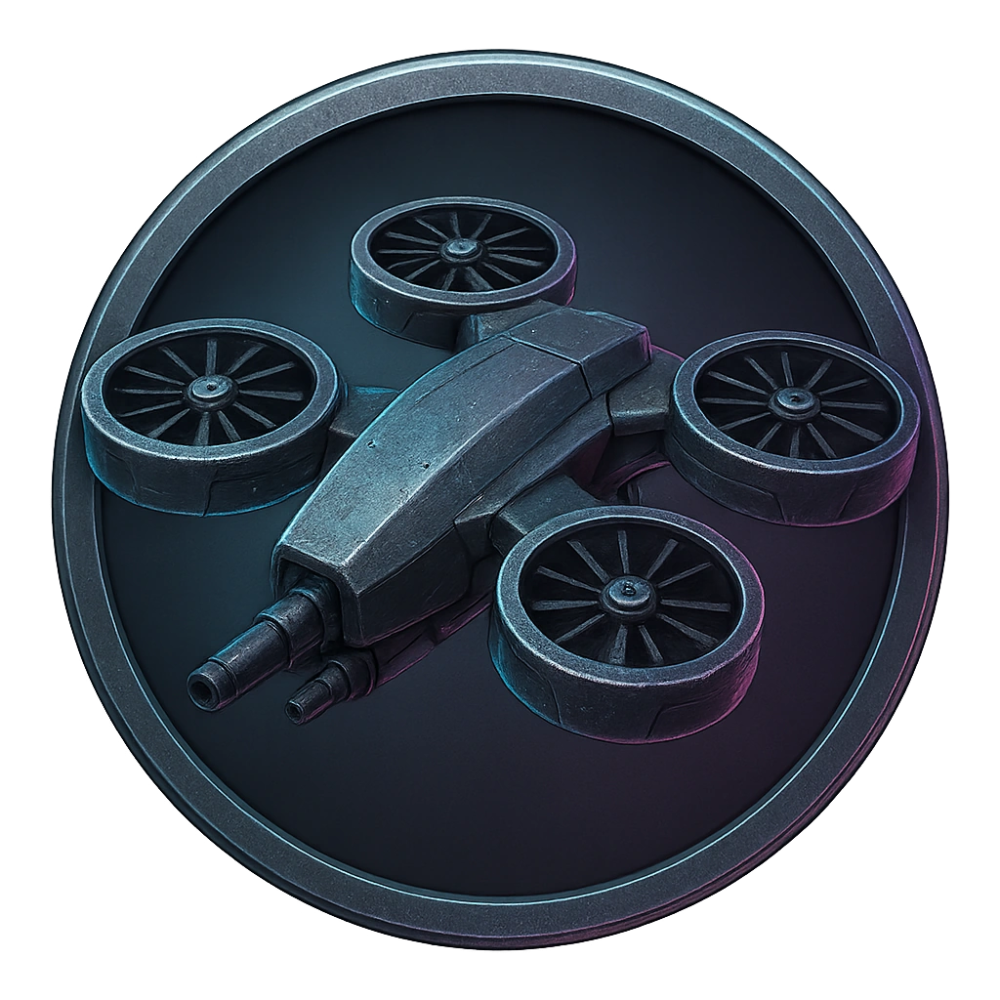

# Autonomous Combat Drone (Aerial)

A hovering drone armed with light kinetic weapons.

<table class="stat-table">
  <thead><tr><th>Attribute</th><th align="right">Value</th></tr></thead>
  <tbody>
    <tr><td>Tier</td><td align="right">2</td></tr>
    <tr><td>Role</td><td align="right">Skulk</td></tr>
    <tr><td>Difficulty</td><td align="right">12</td></tr>
    <tr><td>Damage Thresholds</td><td align="right">5 / 8</td></tr>
    <tr><td>Hit Points</td><td align="right">5</td></tr>
    <tr><td>Stress</td><td align="right">1</td></tr>
  </tbody>
</table>

## Attack

| Attack | Modifier | Range | Damage |
|---|---:|---|---|
| Drone Burst | +3 | Close | d10 Physical |

## Experiences
- **Salvage drone core +2**

## Motives & Tactics
Perform hit-and-run aerial sweeps.

## Features
—

---

adversaries/Security devices/Skulk/Tier 2

