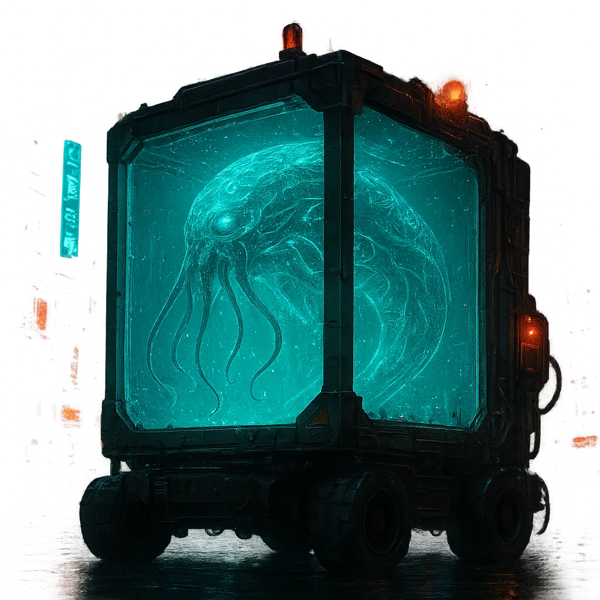

# Bella

(No description yet.)

<table class="stat-table">
  <thead><tr><th>Attribute</th><th align="right">Value</th></tr></thead>
  <tbody>
    <tr><td>Tier</td><td align="right">3</td></tr>
    <tr><td>Role</td><td align="right">Solo</td></tr>
    <tr><td>Difficulty</td><td align="right">18</td></tr>
    <tr><td>Damage Thresholds</td><td align="right">12 / 20</td></tr>
    <tr><td>Hit Points</td><td align="right">15</td></tr>
    <tr><td>Stress</td><td align="right">8</td></tr>
  </tbody>
</table>

## Attack

| Attack | Modifier | Range | Damage |
|---|---:|---|---|
| Psychic blast | +6 | Far | d8+6 Physical |

## Experiences
—

## Motives & Tactics
—

## Features
### Reality Quake

Spend a Fear to rattle the edges of reality within Far range of the Abomination. All targets within that area must succeed on a Knowledge Reaction Roll or become Unstuck from reality until the end of the scene. When an Unstuck target spends Hope or marks Armor Slots, HP, or Stress, they must double the amount spent or marked.

@Template[type:emanation|range:f]

- **Roll Save** (*Action*) — f]

### Supressing Blast

Mark a Stress and target a group within Far range. All targets must succeed on an Agility Reaction Roll or take 1d8+2 magic damage. You gain a Fear for each target who marked HP from this attack.

@Template[type:emanation|range:f]

- **Attack** (*Action*) — f]

### Move as a Unit

Spend 2 Fear to spotlight up to fi ve allies within Far range.

### We Are One

Once per scene, spend a Fear to spotlight all other adversaries within Far range. Attacks they make while spotlighted in this way deal half damage.

---

adversaries/Adversaries/Tier 1

