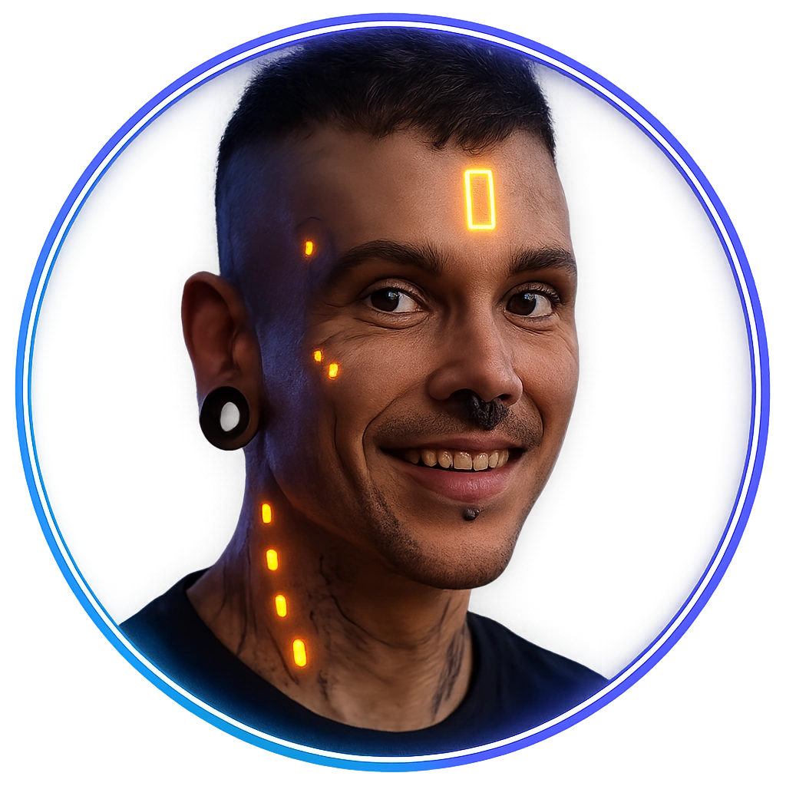

# Body-mod Enthusiast

A citizen proudly displaying fresh cosmetic and functional augments.

<table class="stat-table">
  <thead><tr><th>Attribute</th><th align="right">Value</th></tr></thead>
  <tbody>
    <tr><td>Tier</td><td align="right">1</td></tr>
    <tr><td>Role</td><td align="right">Standard</td></tr>
    <tr><td>Difficulty</td><td align="right">11</td></tr>
    <tr><td>Damage Thresholds</td><td align="right">3 / 5</td></tr>
    <tr><td>Hit Points</td><td align="right">5</td></tr>
    <tr><td>Stress</td><td align="right">2</td></tr>
  </tbody>
</table>

## Attack

| Attack | Modifier | Range | Damage |
|---|---:|---|---|
| Augmented Jab | +1 | Close | d6 Physical |

## Experiences
- **Learn about cyberware sources +1**

## Motives & Tactics
Likes to show off and talk big; if provoked, uses augments for quick jabs or shoves.

## Features
—

## Notes
Knows clinics, mod artists, and rumors about black-market cyberware.

---

adversaries/Regular people (non-combatants)

