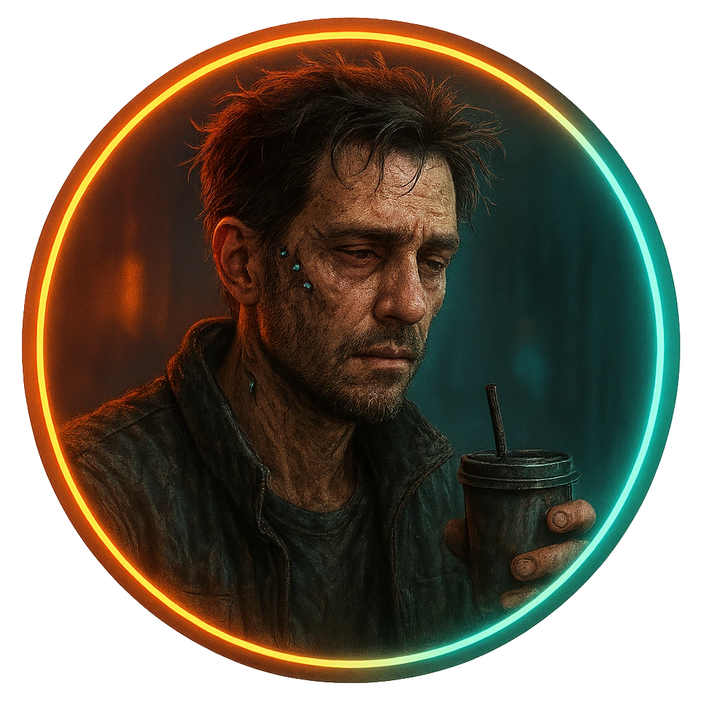

# Burned-out Decker

A hacker whose nerves and implants are half-shot but who can still think sideways when pressed.

<table class="stat-table">
  <thead><tr><th>Attribute</th><th align="right">Value</th></tr></thead>
  <tbody>
    <tr><td>Tier</td><td align="right">1</td></tr>
    <tr><td>Role</td><td align="right">Skulk</td></tr>
    <tr><td>Difficulty</td><td align="right">11</td></tr>
    <tr><td>Damage Thresholds</td><td align="right">3 / 5</td></tr>
    <tr><td>Hit Points</td><td align="right">5</td></tr>
    <tr><td>Stress</td><td align="right">2</td></tr>
  </tbody>
</table>

## Attack

| Attack | Modifier | Range | Damage |
|---|---:|---|---|
| Shock Baton Jab | +1 | Close | d6-1 Physical |

## Experiences
- **Trade data or exploits +1**

## Motives & Tactics
Avoids physical confrontation, uses positioning and environment; only fights if their exit is blocked.

## Features
—

## Notes
Has basic access to local low-tier systems and backdoor knowledge.

---

adversaries/Regular people (non-combatants)

