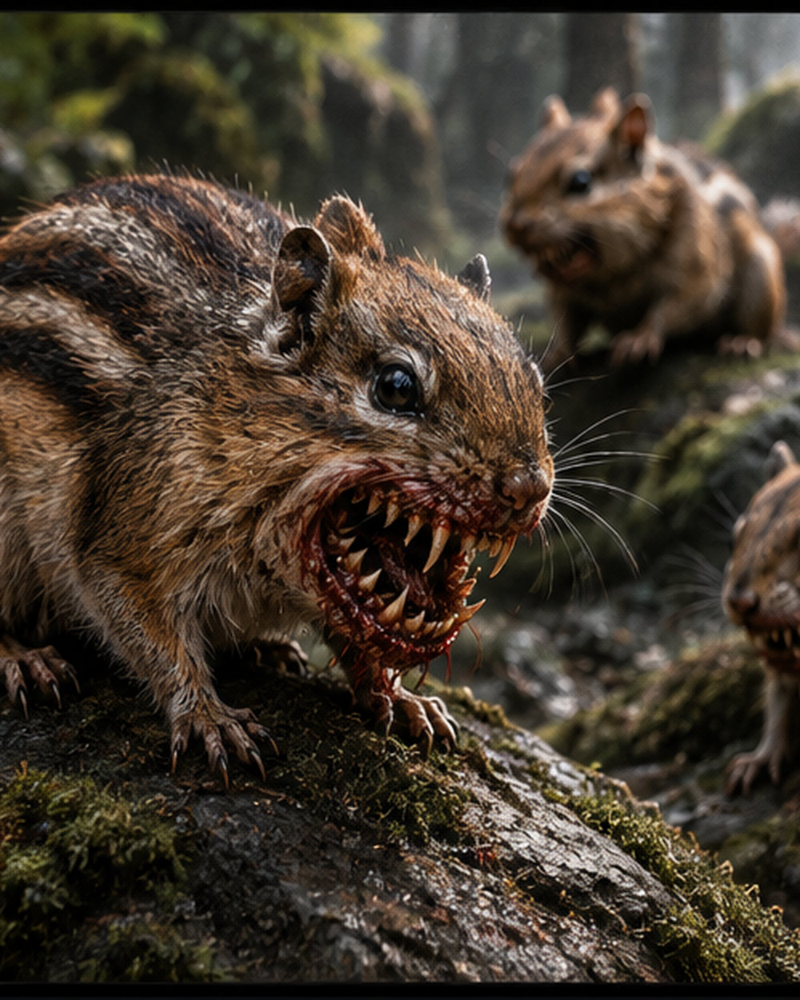

# Cascade Burrowtail

A fluffy, curious Cascade squirrel or chipmunk whose harmless appearance hides backward-hooked teeth and a horrific instinct to burrow into living flesh.

FAST PLAYOpening: Approach harmlessly and get into Melee before revealing the threat.

Default: Needle Bite an exposed target, preferably one without a Burrowing Countdown.

On HP Marked: Resolve Leap and Burrow; once per GM turn, also trigger Blood Calls the Colony.

Pressure: Spread new Burrowtails across exposed targets while attached victims decide whether to spend actions extracting them.

Remember: Tick the countdown after each victim action. Embedded Burrowtails do not take spotlights; remember Under the Skin on Fear triggers.

Goal: Turn one successful bite into an escalating triage problem before the parasites get under the skin.

<table class="stat-table">
  <thead><tr><th>Attribute</th><th align="right">Value</th></tr></thead>
  <tbody>
    <tr><td>Tier</td><td align="right">1</td></tr>
    <tr><td>Role</td><td align="right">Minion</td></tr>
    <tr><td>Difficulty</td><td align="right">12</td></tr>
    <tr><td>Damage Thresholds</td><td align="right"> / </td></tr>
    <tr><td>Hit Points</td><td align="right">1</td></tr>
    <tr><td>Stress</td><td align="right">1</td></tr>
  </tbody>
</table>

## Attack

| Attack | Modifier | Range | Damage |
|---|---:|---|---|
| Needle Bite | +1 | Melee | d4 Physical |

## Experiences
- **Scurrying +2**
- **Natural Camouflage +2**

## Motives & Tactics
approach innocently, swarm exposed targets, latch on, burrow into flesh, call more of the colony

## Features
### Minion (3)

The Burrowtail is defeated when it takes any damage. For every 3 damage a PC deals to the Burrowtail, defeat an additional Burrowtail within range that the attack would succeed against.

### Cute Until It Isn’t

Before a Burrowtail attacks or openly reveals its altered anatomy, creatures have disadvantage on rolls to recognize it as dangerous.

### Leap and Burrow

When a target marks HP from the Burrowtail’s Needle Bite, the Burrowtail latches onto them instead of remaining as a normal adversary. Start a Burrowing Countdown (3) on that target and remove the Burrowtail token from normal play. At the end of each action the affected target takes, tick the countdown down by 1. Before it triggers, the target or an ally within Melee range can use an action to attempt to remove the Burrowtail with a successful Finesse or Strength Roll (12). On a success, the Burrowtail is removed and defeated.

### Under the Skin

When the Burrowing Countdown triggers, the Burrowtail disappears beneath the target’s skin and can no longer be harmed by ordinary attacks. Whenever that creature rolls with Fear, or the GM spends a Fear while that creature is in the scene, they mark 1 HP. Removing the embedded Burrowtail requires surgery, appropriate medical treatment, Cybermancy, or another plausible intervention.

### Blood Calls the Colony

When a Burrowtail successfully deals enough damage with Needle Bite for the target to mark HP, immediately place 1d4 additional Cascade Burrowtail Minions within Close range. This feature can trigger only once per GM turn.

---

adversaries/Adversaries/Tier 1

