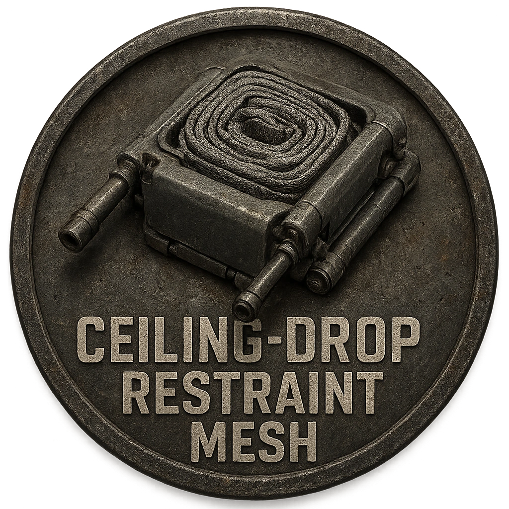

# Ceiling-Drop Restraint Mesh

A silent restraint mesh that drops from overhead panels.

<table class="stat-table">
  <thead><tr><th>Attribute</th><th align="right">Value</th></tr></thead>
  <tbody>
    <tr><td>Tier</td><td align="right">1</td></tr>
    <tr><td>Role</td><td align="right">Support</td></tr>
    <tr><td>Difficulty</td><td align="right">10</td></tr>
    <tr><td>Damage Thresholds</td><td align="right">3 / 5</td></tr>
    <tr><td>Hit Points</td><td align="right">3</td></tr>
    <tr><td>Stress</td><td align="right">1</td></tr>
  </tbody>
</table>

## Attack

| Attack | Modifier | Range | Damage |
|---|---:|---|---|
| Mesh Snare | +1 | Close | d4 Physical |

## Experiences
- **Disarm release hooks +2**

## Motives & Tactics
Capture intruders in chokepoints.

## Features
### Entangle

—

- **Entangle** (*Action*) — A net drops explosively from the ceiling entangling all creatures within Close.

All creatures within Close must make a Reaction check against the Difficulty of this device or else be Restrained

---

adversaries/Security devices/Support/Tier 1

