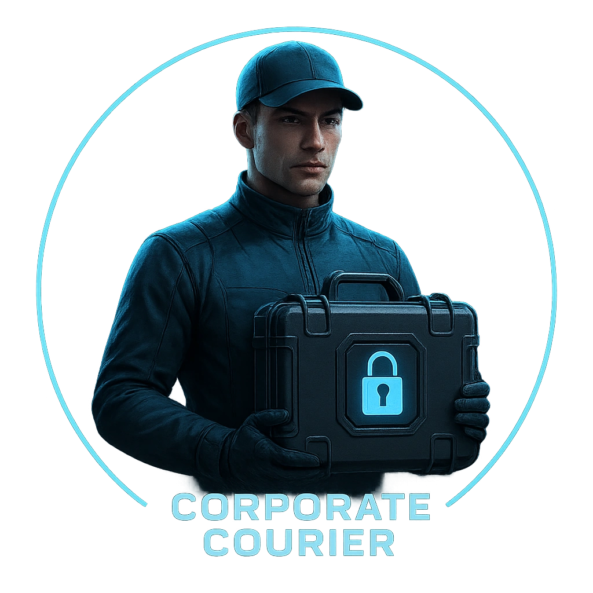

# Corporate Courier

A sleek courier trusted to move sensitive packages between secure sites.

<table class="stat-table">
  <thead><tr><th>Attribute</th><th align="right">Value</th></tr></thead>
  <tbody>
    <tr><td>Tier</td><td align="right">2</td></tr>
    <tr><td>Role</td><td align="right">Skulk</td></tr>
    <tr><td>Difficulty</td><td align="right">12</td></tr>
    <tr><td>Damage Thresholds</td><td align="right">4 / 7</td></tr>
    <tr><td>Hit Points</td><td align="right">5</td></tr>
    <tr><td>Stress</td><td align="right">2</td></tr>
  </tbody>
</table>

## Attack

| Attack | Modifier | Range | Damage |
|---|---:|---|---|
| Disabling Kick | +2 | Close | d6 Physical |

## Experiences
- **Intercept a high-value delivery +2**

## Motives & Tactics
Avoids conflict with precision; uses speed and environment to break line of sight, striking only to open an escape.

## Features
—

## Notes
Carries encrypted cargo and knows backdoor routes through corporate territory.

---

adversaries/Regular people (non-combatants)

