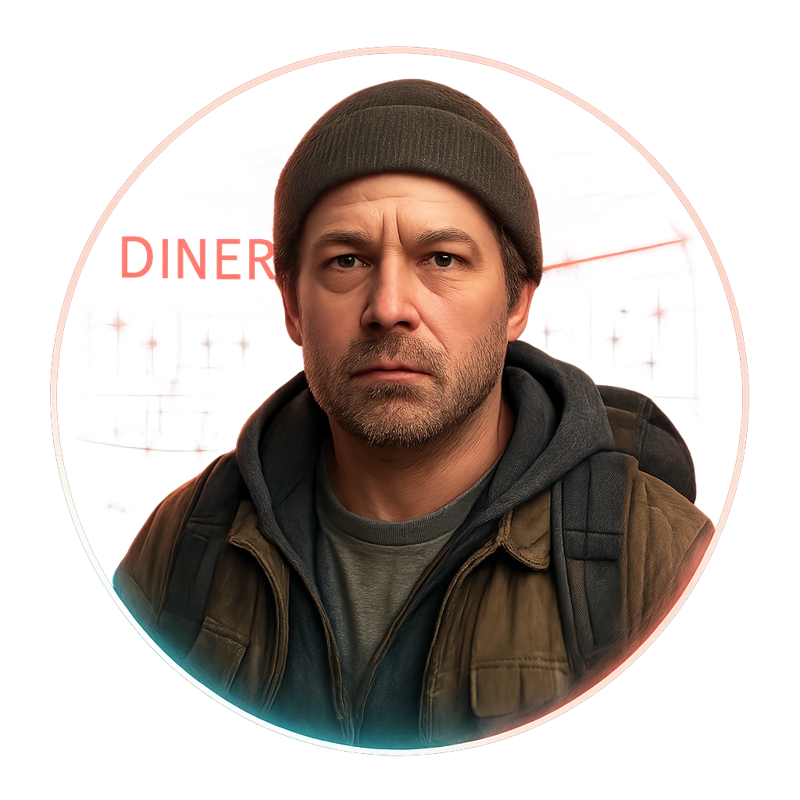

# Diner Regular with Backpack

A regular who treats the booth like a second home and the backpack like a lifeline.

<table class="stat-table">
  <thead><tr><th>Attribute</th><th align="right">Value</th></tr></thead>
  <tbody>
    <tr><td>Tier</td><td align="right">1</td></tr>
    <tr><td>Role</td><td align="right">Skulk</td></tr>
    <tr><td>Difficulty</td><td align="right">10</td></tr>
    <tr><td>Damage Thresholds</td><td align="right">3 / 5</td></tr>
    <tr><td>Hit Points</td><td align="right">5</td></tr>
    <tr><td>Stress</td><td align="right">2</td></tr>
  </tbody>
</table>

## Attack

| Attack | Modifier | Range | Damage |
|---|---:|---|---|
| Pack Swing | +1 | Close | d6-1 Physical |

## Experiences
- **Gain a street-level guide +1**

## Motives & Tactics
Keeps their head down until threatened, then fights to protect their pack and escape.

## Features
—

## Notes
Carries most of their worldly possessions and knows who comes and goes.

---

adversaries/Regular people (non-combatants)

