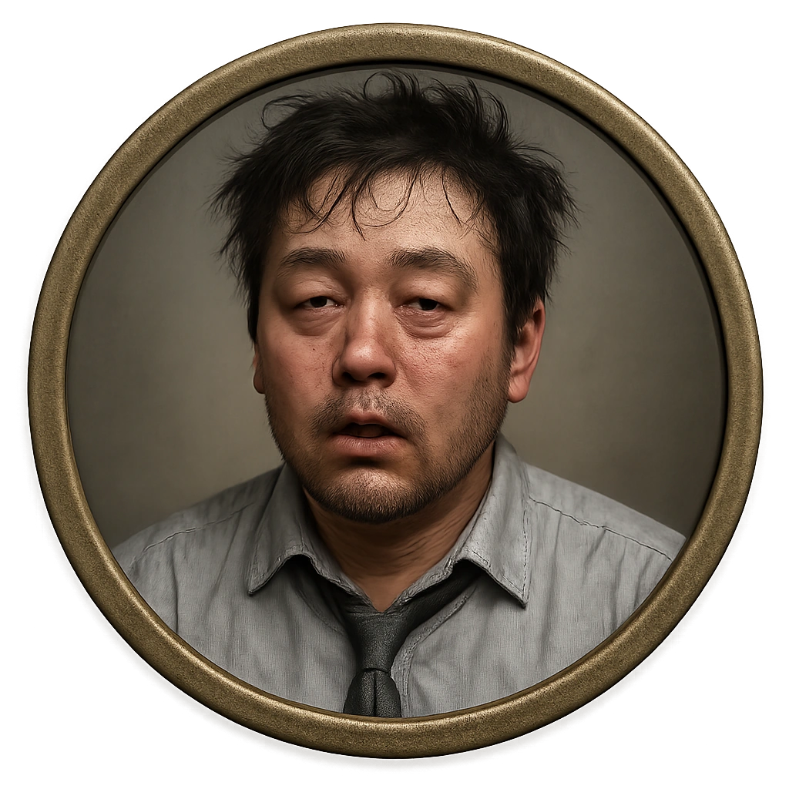

# Drunk Salaryman

A corporate employee several drinks past their limit and several hours past their shift.

<table class="stat-table">
  <thead><tr><th>Attribute</th><th align="right">Value</th></tr></thead>
  <tbody>
    <tr><td>Tier</td><td align="right">1</td></tr>
    <tr><td>Role</td><td align="right">Standard</td></tr>
    <tr><td>Difficulty</td><td align="right">9</td></tr>
    <tr><td>Damage Thresholds</td><td align="right">3 / 5</td></tr>
    <tr><td>Hit Points</td><td align="right">5</td></tr>
    <tr><td>Stress</td><td align="right">2</td></tr>
  </tbody>
</table>

## Attack

| Attack | Modifier | Range | Damage |
|---|---:|---|---|
| Sloppy Haymaker | +1 | Close | d6-1 Physical |

## Experiences
- **Coax secrets from loose lips +1**

## Motives & Tactics
Staggers and blusters, swings once or twice before collapsing or retreating.

## Features
—

## Notes
May let slip confidential details without realizing it.

---

adversaries/Regular people (non-combatants)

