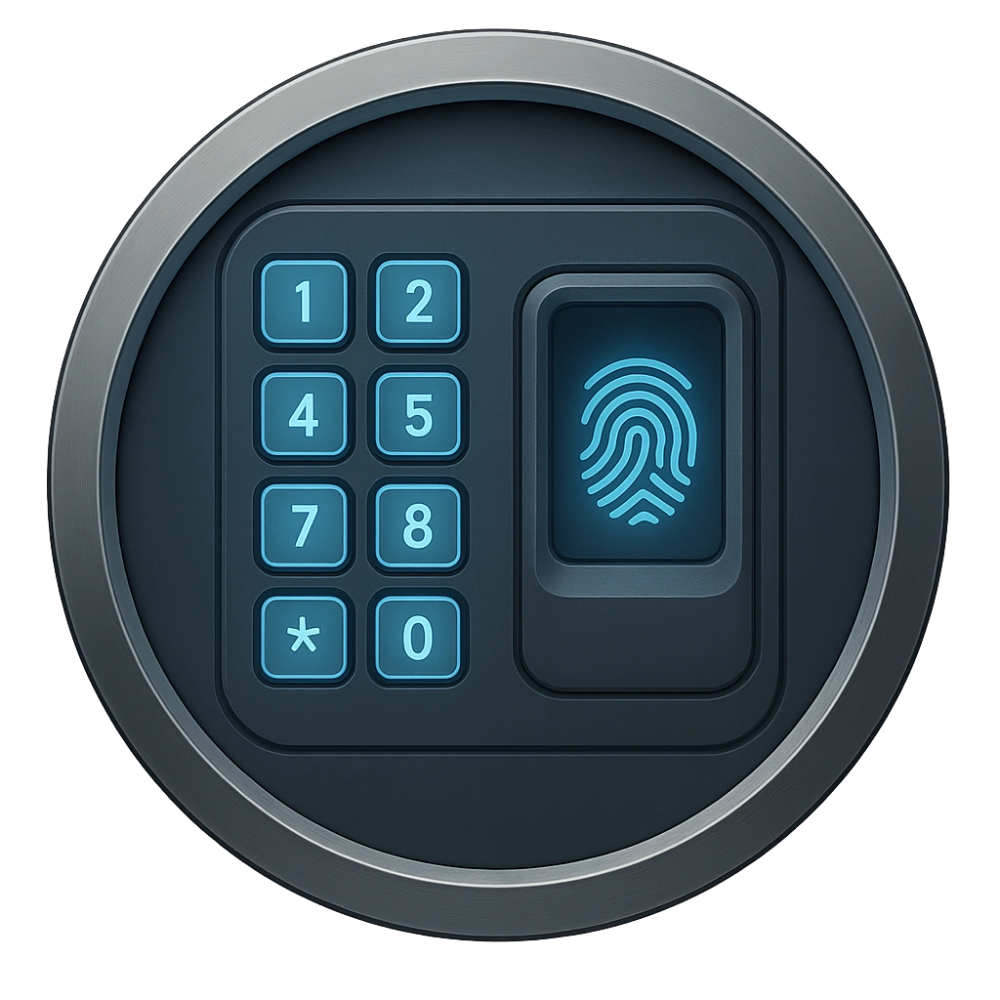

# Electronic Door Lock

A secured access panel using RFID, biometrics, or encoded credentials.

<table class="stat-table">
  <thead><tr><th>Attribute</th><th align="right">Value</th></tr></thead>
  <tbody>
    <tr><td>Tier</td><td align="right">1</td></tr>
    <tr><td>Role</td><td align="right">Standard</td></tr>
    <tr><td>Difficulty</td><td align="right">10</td></tr>
    <tr><td>Damage Thresholds</td><td align="right">3 / 6</td></tr>
    <tr><td>Hit Points</td><td align="right">1</td></tr>
    <tr><td>Stress</td><td align="right">0</td></tr>
  </tbody>
</table>

## Attack

| Attack | Modifier | Range | Damage |
|---|---:|---|---|
| No attack | +0 | Melee | d6 Physical |

## Experiences
- **Bypass or Breach +1**

## Motives & Tactics
block access; log entries

## Features
—

## Notes
Device access levels:

Infiltrate actions:

Lock / unlock

Lock or unlock the door that this device is attached to

Access logs

Access how this device was used recently

Control actions:

Change passcode

Change the passcode until your next Long Rest

Enable / disable

Turn the device on or off

Booby trap

Next person that attempts to use this device receives an electric shock doing d8 direct damage and rendering them Vulnerable until the GM spends 1 Fear

---

adversaries/Common devices

