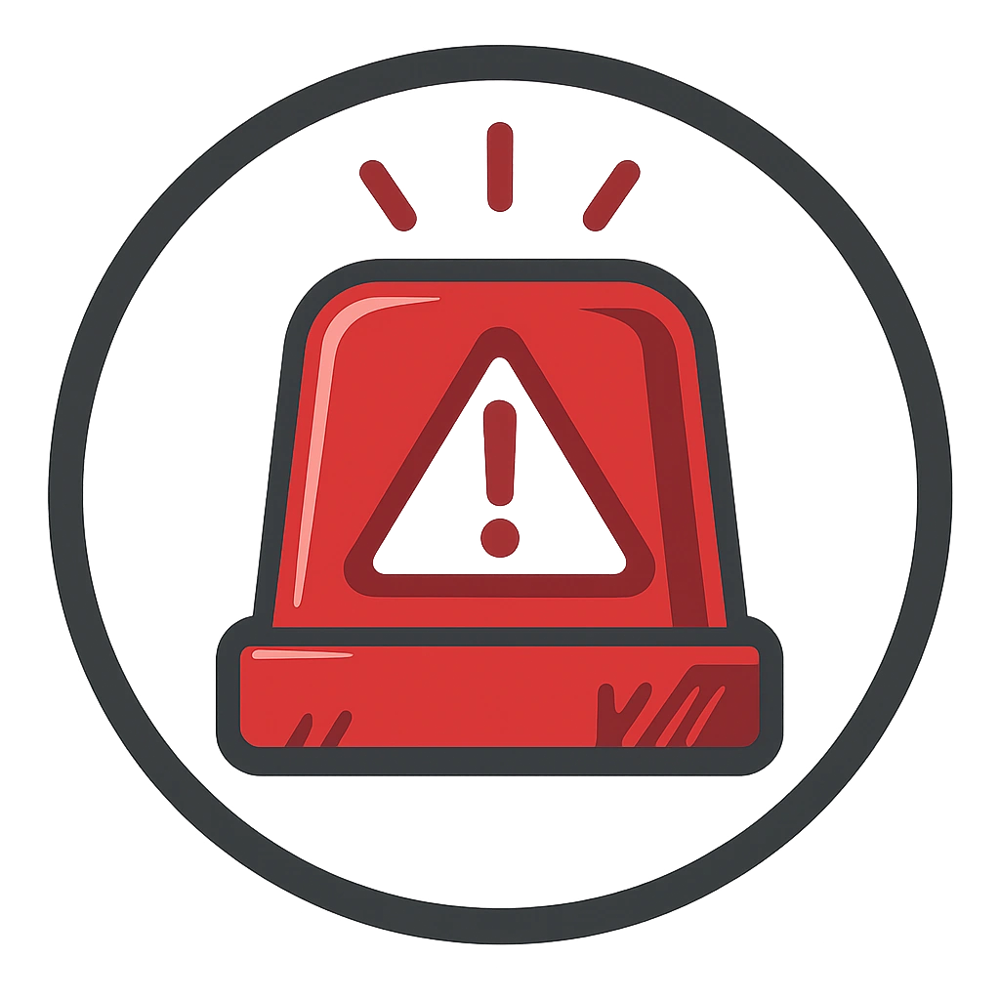

# Emergency Call Beacon

A wall-mounted beacon that pings responders and logs distress calls.

<table class="stat-table">
  <thead><tr><th>Attribute</th><th align="right">Value</th></tr></thead>
  <tbody>
    <tr><td>Tier</td><td align="right">1</td></tr>
    <tr><td>Role</td><td align="right">Support</td></tr>
    <tr><td>Difficulty</td><td align="right">9</td></tr>
    <tr><td>Damage Thresholds</td><td align="right">2 / 5</td></tr>
    <tr><td>Hit Points</td><td align="right">1</td></tr>
    <tr><td>Stress</td><td align="right">0</td></tr>
  </tbody>
</table>

## Attack

| Attack | Modifier | Range | Damage |
|---|---:|---|---|
| No attack | +0 | Melee | d6 Physical |

## Experiences
- **Alarm Trigger +1**

## Motives & Tactics
raise alarm; tag location

## Features
—

## Notes
Device access levels:

Infiltrate actions:

Enable or Disable

Turn the device on or off

Set volume

Change the level of noise generated by the beacon

Set illumination

Change the level of light emitted by the beacon

Access logs

Access how this device was used recently

Control actions:

Reprogram sound

Cause the beacon to emit a new repetative sound at any volume level. The sound illusion can be perceived with a difficulty check equal to the Difficulty of the device

Detonate

d4 damage to all creatures within Very Close. Make a Reaction check against this device's Difficulty to take half damage.

Send message

Cause the beason to emit a message to all subscribed devices and personnel

---

adversaries/Common devices

