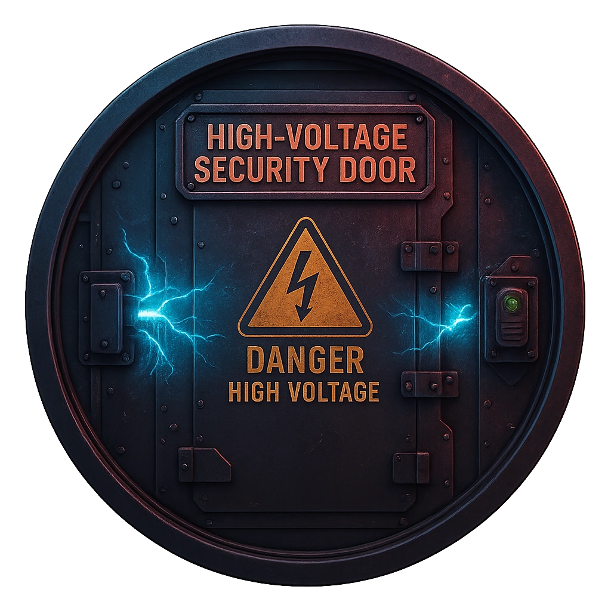

# High-Voltage Security Door

A fortified door that shocks unauthorized contact.

<table class="stat-table">
  <thead><tr><th>Attribute</th><th align="right">Value</th></tr></thead>
  <tbody>
    <tr><td>Tier</td><td align="right">1</td></tr>
    <tr><td>Role</td><td align="right">Support</td></tr>
    <tr><td>Difficulty</td><td align="right">10</td></tr>
    <tr><td>Damage Thresholds</td><td align="right">4 / 6</td></tr>
    <tr><td>Hit Points</td><td align="right">3</td></tr>
    <tr><td>Stress</td><td align="right">1</td></tr>
  </tbody>
</table>

## Attack

| Attack | Modifier | Range | Damage |
|---|---:|---|---|
| Arc Discharge | +2 | Close | d10 Physical |

## Experiences
- **Bypass lock node +1**

## Motives & Tactics
Hold positions and punish forced entry.

## Features
—

---

adversaries/Security devices/Support/Tier 1

