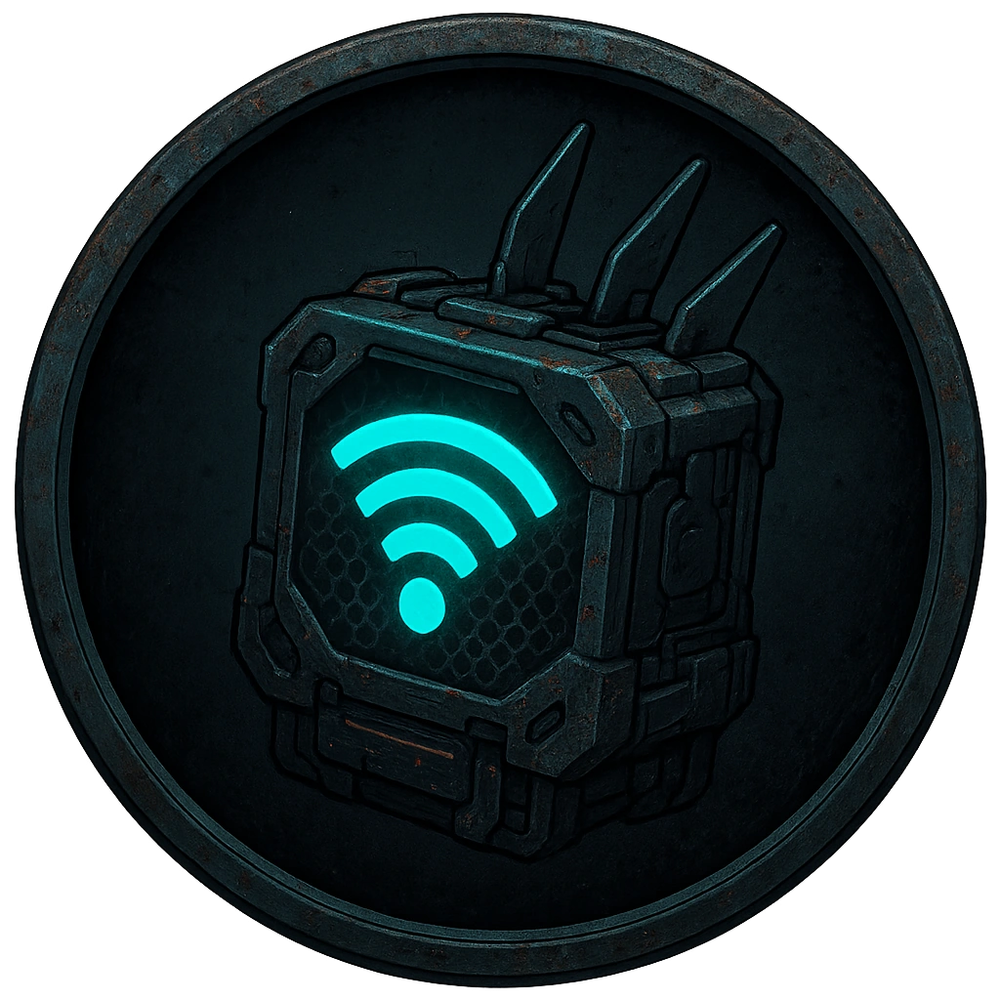

# Matrix Relay Node

A mesh-network repeater extending wireless coverage through a location.

<table class="stat-table">
  <thead><tr><th>Attribute</th><th align="right">Value</th></tr></thead>
  <tbody>
    <tr><td>Tier</td><td align="right">1</td></tr>
    <tr><td>Role</td><td align="right">Support</td></tr>
    <tr><td>Difficulty</td><td align="right">9</td></tr>
    <tr><td>Damage Thresholds</td><td align="right">3 / 6</td></tr>
    <tr><td>Hit Points</td><td align="right">1</td></tr>
    <tr><td>Stress</td><td align="right">0</td></tr>
  </tbody>
</table>

## Attack

| Attack | Modifier | Range | Damage |
|---|---:|---|---|
| No attack | +0 | Melee | d6 Physical |

## Experiences
- **Device Interaction +1**

## Motives & Tactics
extend signal; route traffic

## Features
—

## Notes
Device access levels:

Infiltrate actions:

Access Logs

Access how this device was used recently

Enable or Disable

Turn the device on or off

Sniff network traffc

Monitor network traffic passing through this device.  Spend 1 Hope and make a Spellcasting (Hacking) check to determine the level and depth of information accessed

Control actions:

Send message

Cause the device to emit a message to all subscribed devices and personnel

Root access

Gain +1 on Infiltration or Control of other devices in the Scene

Reroute network traffic

Take control of the network traffic passing through this node.  Describe the effect you wish to have - Spend 1 Hope and make a Spellcasting (Hacking) check to determine the quality of the outcome

---

adversaries/Common devices

