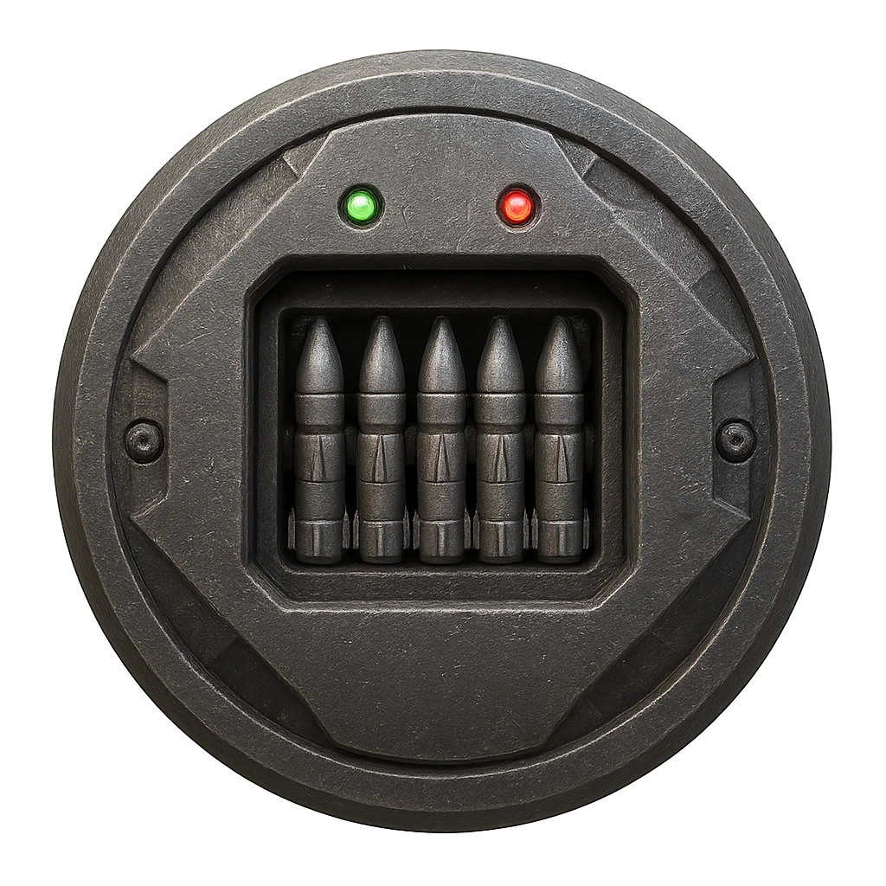

# Micro-Missile Sentry Pod Mk. II

A compact pod that fires guided micro-missiles.

<table class="stat-table">
  <thead><tr><th>Attribute</th><th align="right">Value</th></tr></thead>
  <tbody>
    <tr><td>Tier</td><td align="right">2</td></tr>
    <tr><td>Role</td><td align="right">Ranged</td></tr>
    <tr><td>Difficulty</td><td align="right">12</td></tr>
    <tr><td>Damage Thresholds</td><td align="right">5 / 8</td></tr>
    <tr><td>Hit Points</td><td align="right">5</td></tr>
    <tr><td>Stress</td><td align="right">1</td></tr>
  </tbody>
</table>

## Attack

| Attack | Modifier | Range | Damage |
|---|---:|---|---|
| Micro-Missile | +4 | Far | d6+1 Physical |

## Experiences
- **Recover targeting core +2**

## Motives & Tactics
Target high-threat intruders with precision missiles.

## Features
### Slow Firing

When you spotlight the Turret and they don’t have a token on their stat block, they can’t make a standard attack. Place a token on their stat block and describe what they’re preparing to do. When you spotlight the Turret and they have a token on their stat block, clear the token and they can attack.

### Missle Volley

Mark a Stress to make a standard attack against up to three targets.

### Sleaze Gate

The easiest path is always the one that bites.

Any device with this ICE on it presents itself as Unhardened.  Upon the first attempt by a hacker to take a Control action, the device re-presents itself as Hardened and the hacker must, as a Reaction, make an immediate Spellcasting (Hacking) check with a Difficulty +2.  The outcomes are:

Critical success: the ICE is deactivated no other consequences.

Success with Hope: No negative effects, but the ICE is still active and must be disabled before any Control action can be taken.

Success with Fear: Mark 1 Stress and the ICE is still active and must be disabled before any Control action can be taken.

Failures: the ICE is still active and must be disabled before any Control action can be taken.  

Advance the System alert by 2. 

All Spellcasting (Hacking) attempts are at -2 for the remainder of the Scene

There is a tracker installed on your computer and removing this required the expendature of a Long Rest downtime activity.

- **Sleaze Gate** (*Action*) — The easiest path is always the one that bites.

Appears as a friendly backdoor but injects trackers on use.

---

adversaries/Security devices/Ranged/Tier 2

