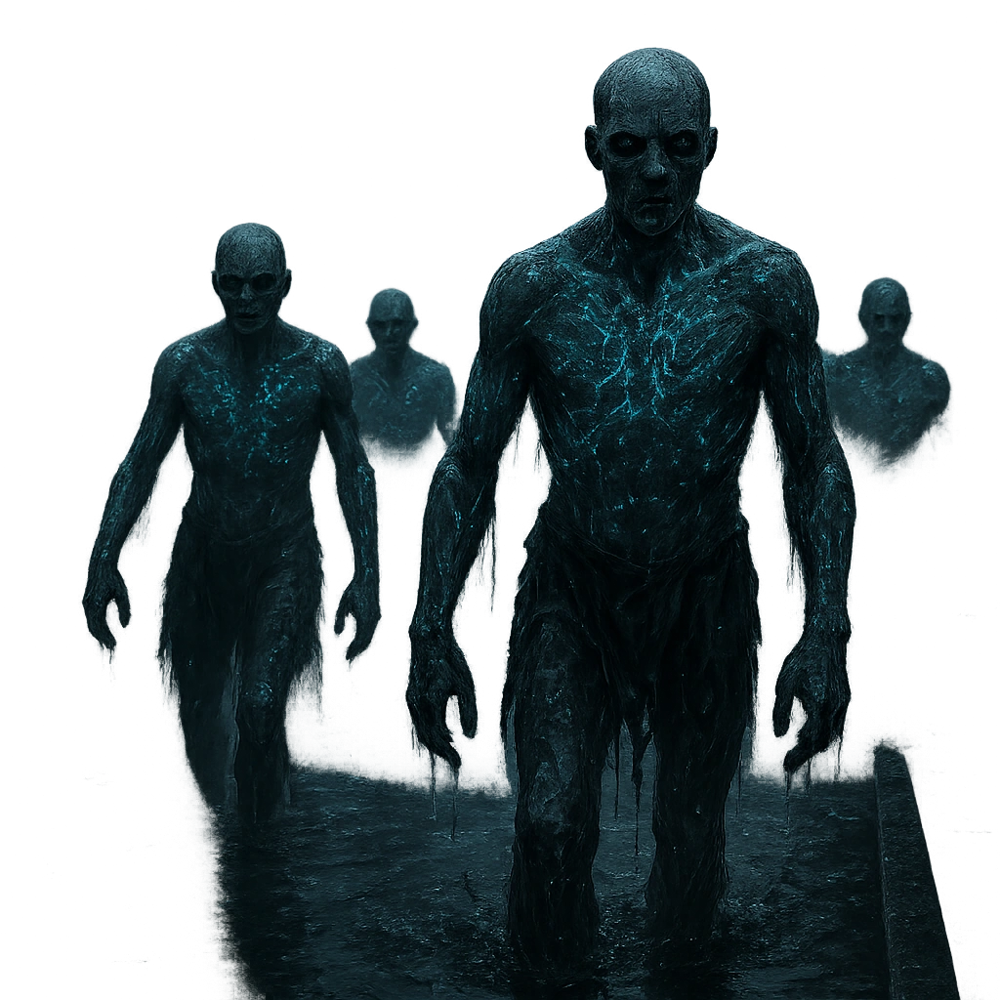

# Moreborn Thrall

Dock workers whose minds have been overwritten by Bella's influence. They move and fight with eerie coordination.

<table class="stat-table">
  <thead><tr><th>Attribute</th><th align="right">Value</th></tr></thead>
  <tbody>
    <tr><td>Tier</td><td align="right">1</td></tr>
    <tr><td>Role</td><td align="right">Standard</td></tr>
    <tr><td>Difficulty</td><td align="right">11</td></tr>
    <tr><td>Damage Thresholds</td><td align="right">0 / 0</td></tr>
    <tr><td>Hit Points</td><td align="right">4</td></tr>
    <tr><td>Stress</td><td align="right">3</td></tr>
  </tbody>
</table>

## Attack

| Attack | Modifier | Range | Damage |
|---|---:|---|---|
| Slam | +1 | Melee | d6+2 Physical |

## Experiences
—

## Motives & Tactics
Hive minded coordination, protect the hive mother

## Features
### Too Many to Handle

When the Thrall is within Melee range of a creature and at least one other Thrall is within Close range, all attacks against that creature have advantage.

### Horrifying

Targets who mark HP from the Zombie’s attacks must also mark a Stress.

### Strike as One

Mark a Stress to spotlight a number of other Thralls equal to the Thrall's unmarked Stress.

- **Mark Stress** (*Action*) — Mark a Stress to spotlight a number of other Assassins equal to the Assassin’s unmarked Stress.

---

adversaries/Adversaries/Tier 1

