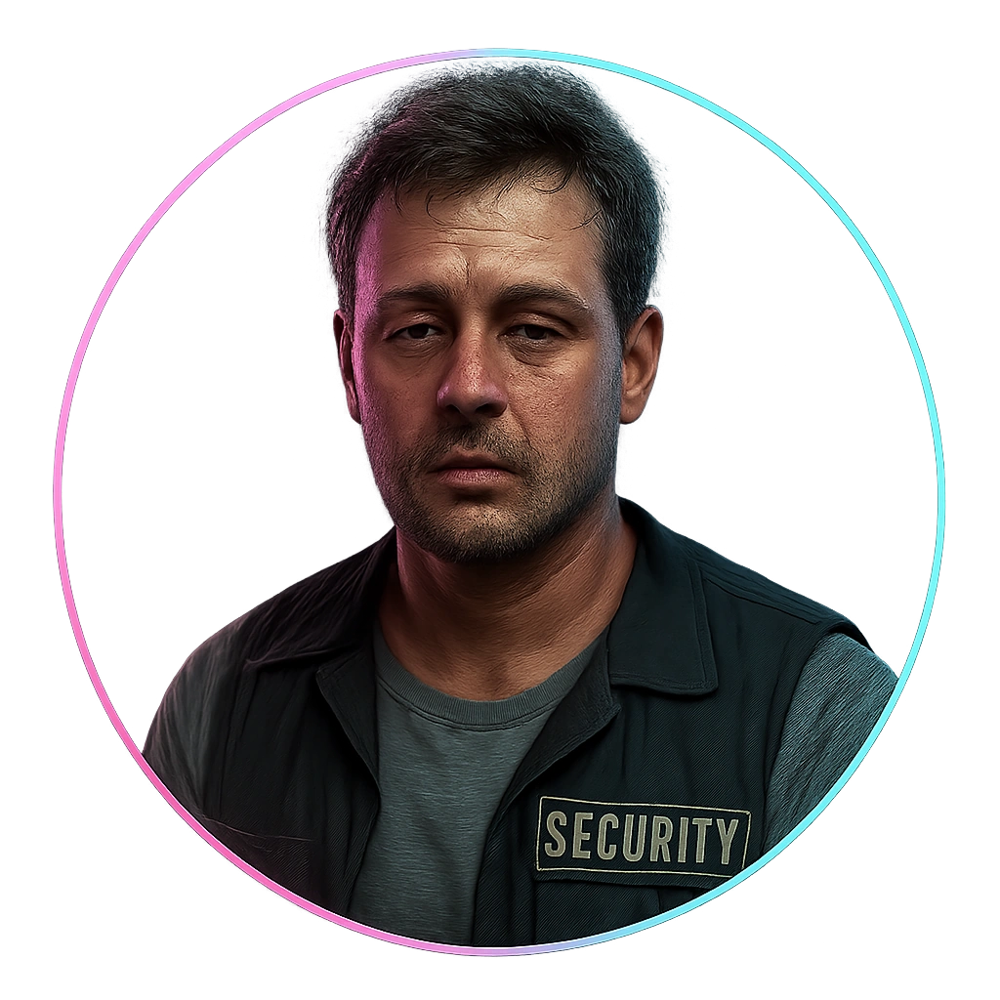

# Off-duty Security Guard

A corp-contracted guard off shift, still wired to read a room like a threat board.

<table class="stat-table">
  <thead><tr><th>Attribute</th><th align="right">Value</th></tr></thead>
  <tbody>
    <tr><td>Tier</td><td align="right">2</td></tr>
    <tr><td>Role</td><td align="right">Standard</td></tr>
    <tr><td>Difficulty</td><td align="right">12</td></tr>
    <tr><td>Damage Thresholds</td><td align="right">5 / 8</td></tr>
    <tr><td>Hit Points</td><td align="right">5</td></tr>
    <tr><td>Stress</td><td align="right">2</td></tr>
  </tbody>
</table>

## Attack

| Attack | Modifier | Range | Damage |
|---|---:|---|---|
| Trained Takedown | +2 | Close | d6+1 Physical |

## Experiences
- **Exploit their security knowledge +2**

## Motives & Tactics
Tries verbal commands first, then precise takedowns; aims to control rather than kill.

## Features
—

## Notes
Knows security protocols, patrol routes, and how corp response teams operate.

---

adversaries/Regular people (non-combatants)

