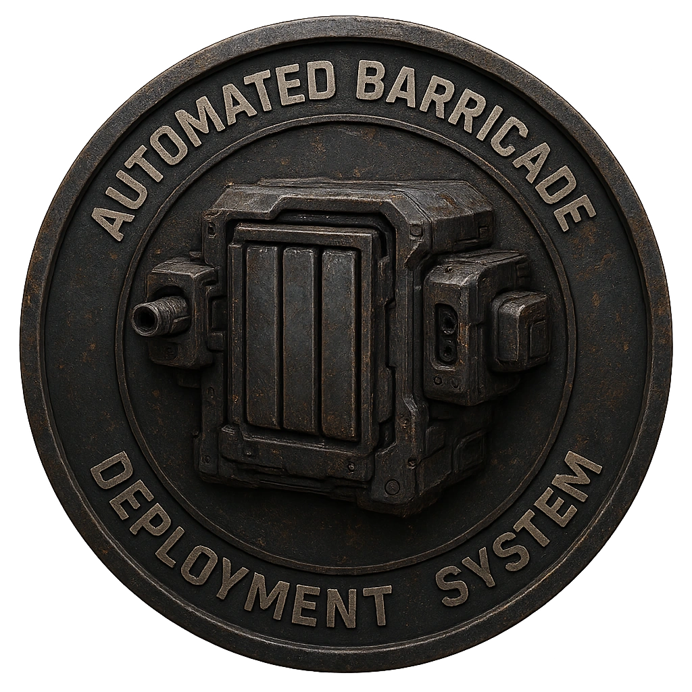

# Portable Auto-Barricade

A mobile barricade drone deploying armored plates.

<table class="stat-table">
  <thead><tr><th>Attribute</th><th align="right">Value</th></tr></thead>
  <tbody>
    <tr><td>Tier</td><td align="right">2</td></tr>
    <tr><td>Role</td><td align="right">Support</td></tr>
    <tr><td>Difficulty</td><td align="right">12</td></tr>
    <tr><td>Damage Thresholds</td><td align="right">5 / 7</td></tr>
    <tr><td>Hit Points</td><td align="right">5</td></tr>
    <tr><td>Stress</td><td align="right">1</td></tr>
  </tbody>
</table>

## Attack

| Attack | Modifier | Range | Damage |
|---|---:|---|---|
| Auto-Plate | +2 | Close | d8 Physical |

## Experiences
- **Recover actuator motor +1**

## Motives & Tactics
Reinforce positions and obstruct movement.

## Features
—

---

adversaries/Security devices/Support/Tier 1

