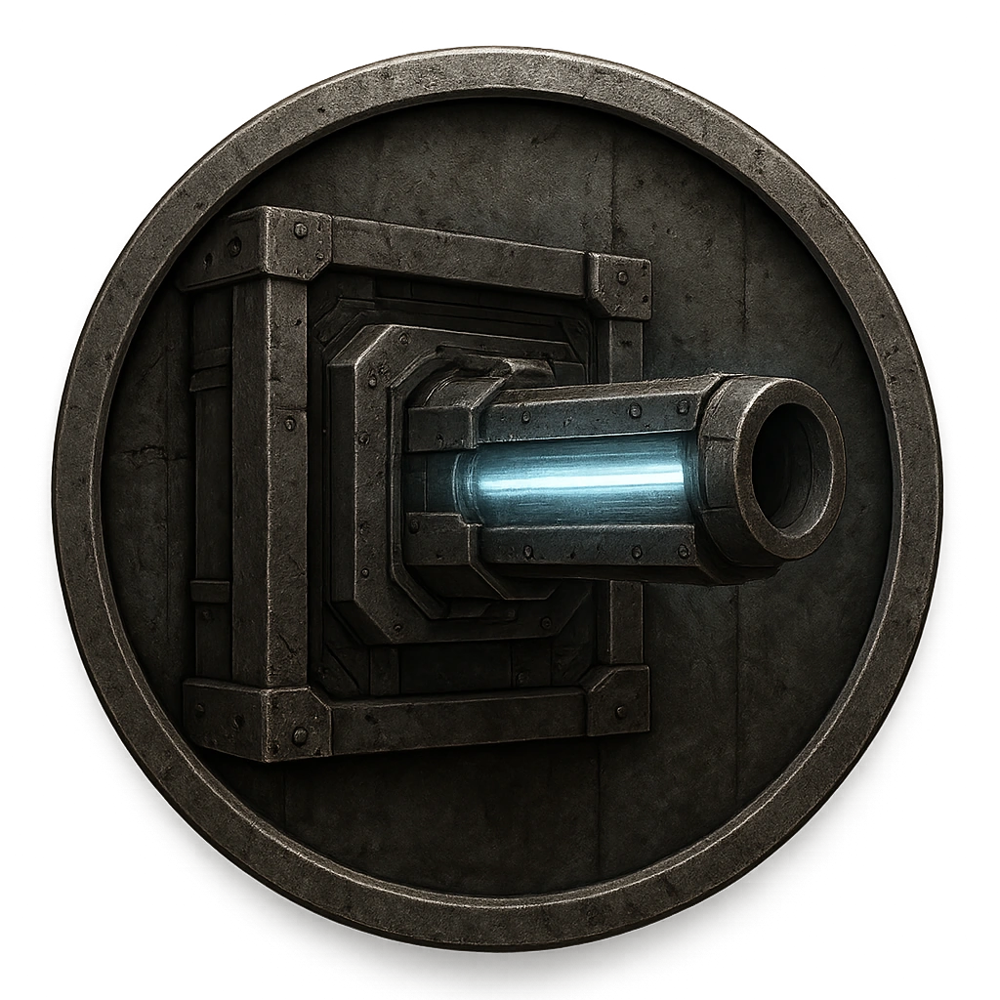

# Rail-Slug Wall Cannon

A wall-embedded railgun firing armor-piercing slugs.

<table class="stat-table">
  <thead><tr><th>Attribute</th><th align="right">Value</th></tr></thead>
  <tbody>
    <tr><td>Tier</td><td align="right">3</td></tr>
    <tr><td>Role</td><td align="right">Ranged</td></tr>
    <tr><td>Difficulty</td><td align="right">14</td></tr>
    <tr><td>Damage Thresholds</td><td align="right">9 / 12</td></tr>
    <tr><td>Hit Points</td><td align="right">7</td></tr>
    <tr><td>Stress</td><td align="right">1</td></tr>
  </tbody>
</table>

## Attack

| Attack | Modifier | Range | Damage |
|---|---:|---|---|
| Rail Slug | +5 | Far | d10 Physical |

## Experiences
- **Retrieve rail magnets +3**

## Motives & Tactics
Target high-value intruders with extreme lethality.

## Features
—

---

adversaries/Security devices/Ranged/Tier 3

