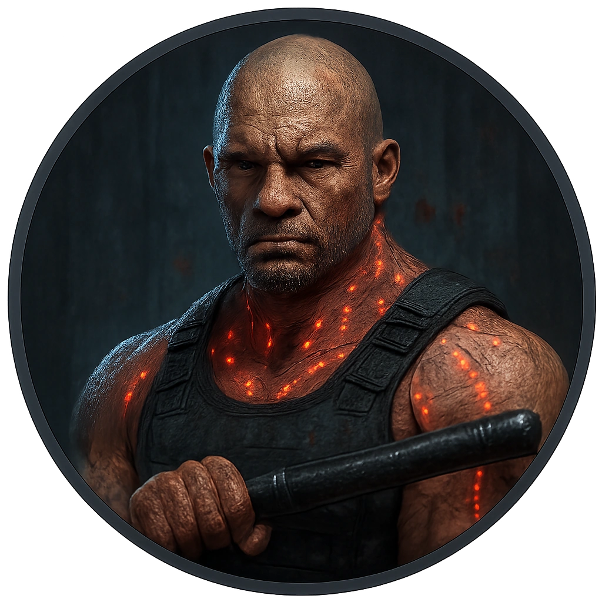

# Rave Enforcer

Implanted subdermal LEDs pulse with hypnotic rhythm. Swings a reinforced baton synchronized to their internal beat-generator.

<table class="stat-table">
  <thead><tr><th>Attribute</th><th align="right">Value</th></tr></thead>
  <tbody>
    <tr><td>Tier</td><td align="right">1</td></tr>
    <tr><td>Role</td><td align="right">Bruiser</td></tr>
    <tr><td>Difficulty</td><td align="right">12</td></tr>
    <tr><td>Damage Thresholds</td><td align="right">8 / 14</td></tr>
    <tr><td>Hit Points</td><td align="right">7</td></tr>
    <tr><td>Stress</td><td align="right">3</td></tr>
  </tbody>
</table>

## Attack

| Attack | Modifier | Range | Damage |
|---|---:|---|---|
| Crowbar | +2 | Melee | d10+3 Physical |

## Experiences
- **Unveiled Threats +3**

## Motives & Tactics
intimidate, bully, steal, protect

## Features
### Bloody Reprisal

When the Brawler marks 2 or more HP from an attack within Very Close range, you can make a standard attack against the attacker. On a success, the Brawler deals 2d6+15 physical damage instead of their standard damage.

### Double Strike

Mark a Stress to make a standard attack against two targets within Melee range.

### Momentum

When the Elemental makes a successful attack against a PC, you gain a Fear.

---

adversaries/Adversaries/Tier 1

