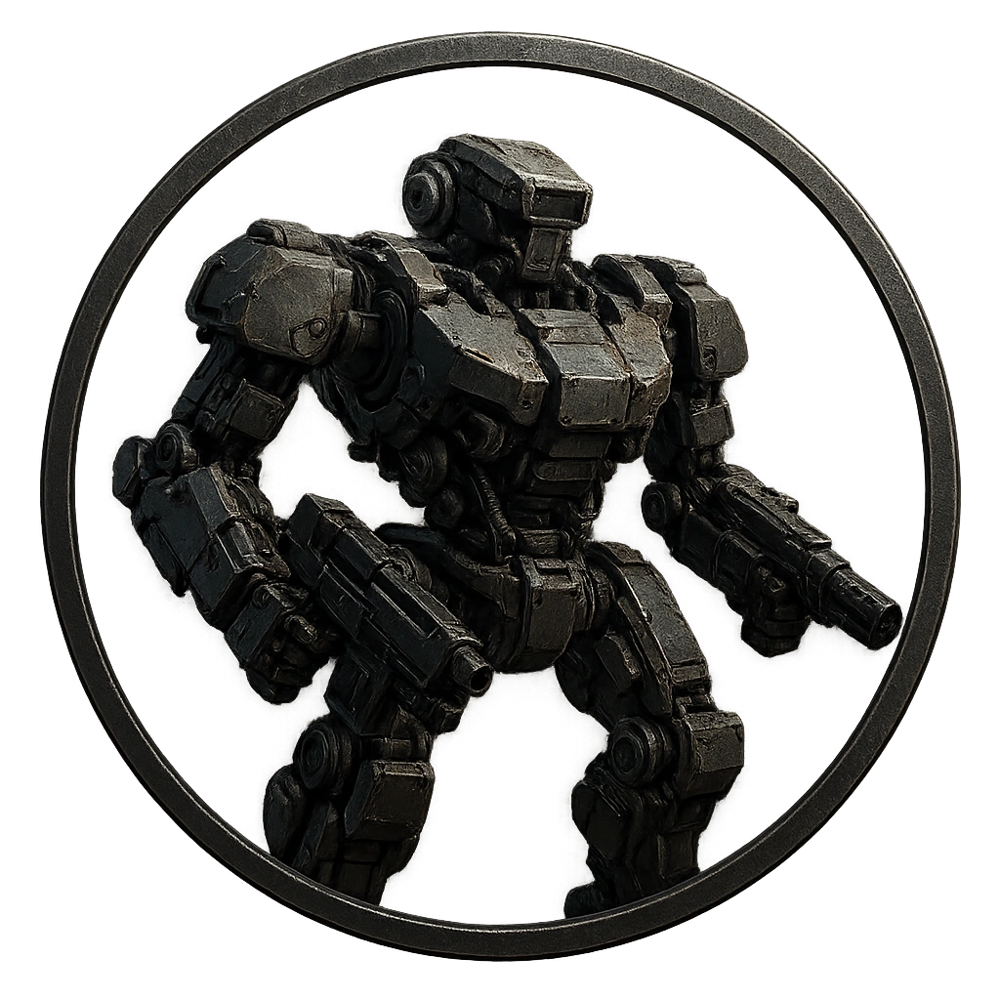

# Security Mech Frame

A compact exosuit used by facility defense teams.

<table class="stat-table">
  <thead><tr><th>Attribute</th><th align="right">Value</th></tr></thead>
  <tbody>
    <tr><td>Tier</td><td align="right">3</td></tr>
    <tr><td>Role</td><td align="right">Bruiser</td></tr>
    <tr><td>Difficulty</td><td align="right">14</td></tr>
    <tr><td>Damage Thresholds</td><td align="right">11 / 15</td></tr>
    <tr><td>Hit Points</td><td align="right">7</td></tr>
    <tr><td>Stress</td><td align="right">1</td></tr>
  </tbody>
</table>

## Attack

| Attack | Modifier | Range | Damage |
|---|---:|---|---|
| Mech Slam | +5 | Close | d8 Physical |

## Experiences
- **Extract actuator core +3**

## Motives & Tactics
Advance aggressively and control space.

## Features
—

---

adversaries/Security devices/Brute/Tier 3

