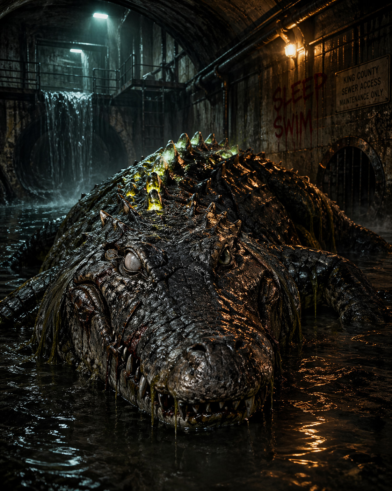

# Sewerjaw Gator

A mutated sewer alligator that ambushes prey in Seattle's underground drainage network.

<table class="stat-table">
  <thead><tr><th>Attribute</th><th align="right">Value</th></tr></thead>
  <tbody>
    <tr><td>Tier</td><td align="right">1</td></tr>
    <tr><td>Role</td><td align="right">Solo</td></tr>
    <tr><td>Difficulty</td><td align="right">13</td></tr>
    <tr><td>Damage Thresholds</td><td align="right">8 / 16</td></tr>
    <tr><td>Hit Points</td><td align="right">8</td></tr>
    <tr><td>Stress</td><td align="right">3</td></tr>
  </tbody>
</table>

## Attack

| Attack | Modifier | Range | Damage |
|---|---:|---|---|
| Crushing Jaws | +3 | Very Close | d12+2 Physical |

## Experiences
- **Sewer Ambush +2**
- **Tremor Sense +2**

## Motives & Tactics
ambush from water, drag prey underwater, feed, retreat into tunnels

## Features
### Relentless (2)

The Sewerjaw Gator can be spotlighted up to two times per GM turn. Spend Fear as usual to spotlight them.

### Death Roll

Mark a Stress to attack a target the Gator has Restrained or otherwise pinned in its jaws. On a success, deal **2d8** physical damage and the target becomes Vulnerable until they next act.

### Drain Surge

The Gator slips into water, sludge, or a drainage opening and reappears anywhere within Far range that is connected by sewer channels, culverts, runoff tunnels, or standing water.

### Filth Spray

When the Gator takes Major damage, all creatures within Very Close range must succeed on an Agility Reaction Roll or mark a Stress as toxic sludge and sewer water spray across the area.

### Cold Water Patience

While partially submerged or hidden in darkness, the Gator gains a +2 bonus to their Difficulty until they attack or otherwise reveal their position.

---

adversaries/Adversaries/Tier 1

