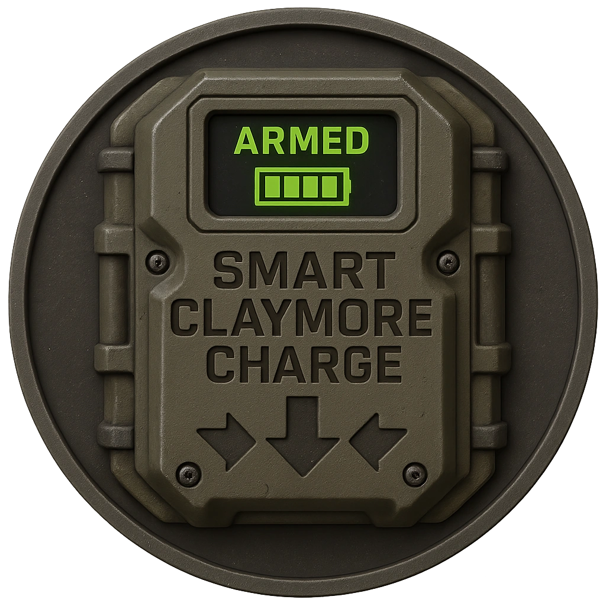

# Smart Claymore Charge

A directional explosive with smart detonation logic.

<table class="stat-table">
  <thead><tr><th>Attribute</th><th align="right">Value</th></tr></thead>
  <tbody>
    <tr><td>Tier</td><td align="right">1</td></tr>
    <tr><td>Role</td><td align="right">Skulk</td></tr>
    <tr><td>Difficulty</td><td align="right">10</td></tr>
    <tr><td>Damage Thresholds</td><td align="right">3 / 5</td></tr>
    <tr><td>Hit Points</td><td align="right">3</td></tr>
    <tr><td>Stress</td><td align="right">1</td></tr>
  </tbody>
</table>

## Attack

| Attack | Modifier | Range | Damage |
|---|---:|---|---|
| Fragment Blast | +3 | Close | d6 Physical |

## Experiences
- **Disarm explosive safely +1**

## Motives & Tactics
Detonate when line-of-sight criteria met.

## Features
—

---

adversaries/Security devices/Skulk/Tier 2

