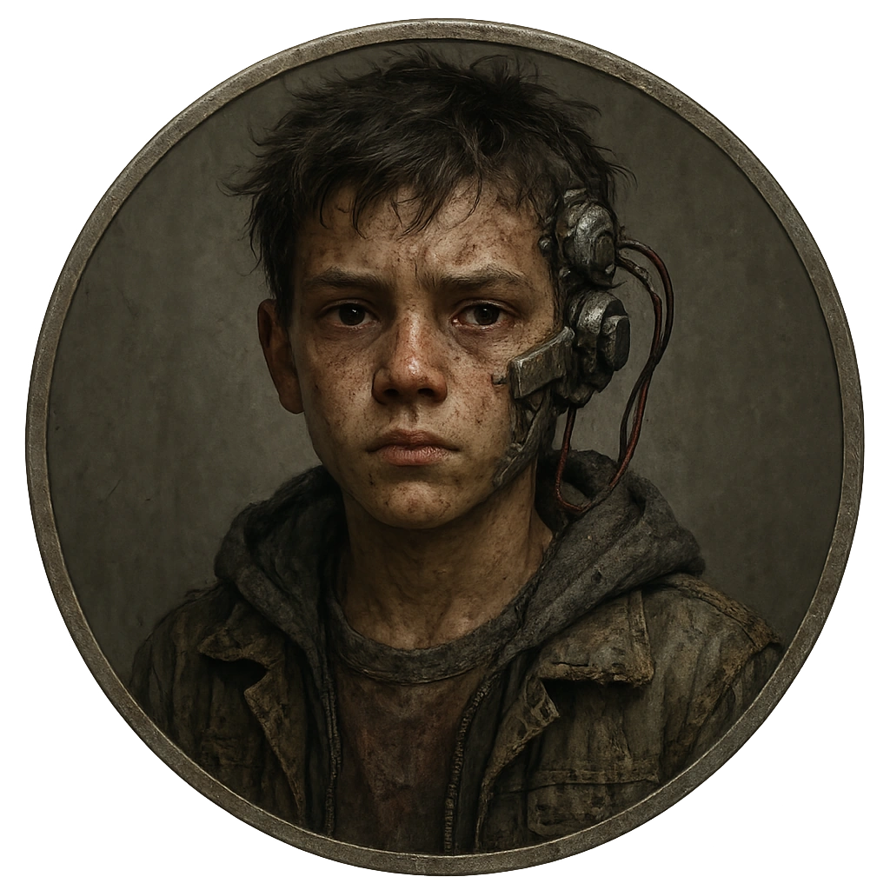

# Street Kid with Scavenged Cyberware

A young survivor with mismatched implants and sharp survival instincts.

<table class="stat-table">
  <thead><tr><th>Attribute</th><th align="right">Value</th></tr></thead>
  <tbody>
    <tr><td>Tier</td><td align="right">1</td></tr>
    <tr><td>Role</td><td align="right">Skulk</td></tr>
    <tr><td>Difficulty</td><td align="right">11</td></tr>
    <tr><td>Damage Thresholds</td><td align="right">3 / 5</td></tr>
    <tr><td>Hit Points</td><td align="right">5</td></tr>
    <tr><td>Stress</td><td align="right">2</td></tr>
  </tbody>
</table>

## Attack

| Attack | Modifier | Range | Damage |
|---|---:|---|---|
| Sucker Punch | +1 | Close | d6-1 Physical |

## Experiences
- **Show them a better option +1**

## Motives & Tactics
Acts fast and dirty, using distraction and hit-and-run tactics before disappearing.

## Features
—

## Notes
Understands alleys, shortcuts, and who really owns the streets.

---

adversaries/Regular people (non-combatants)

