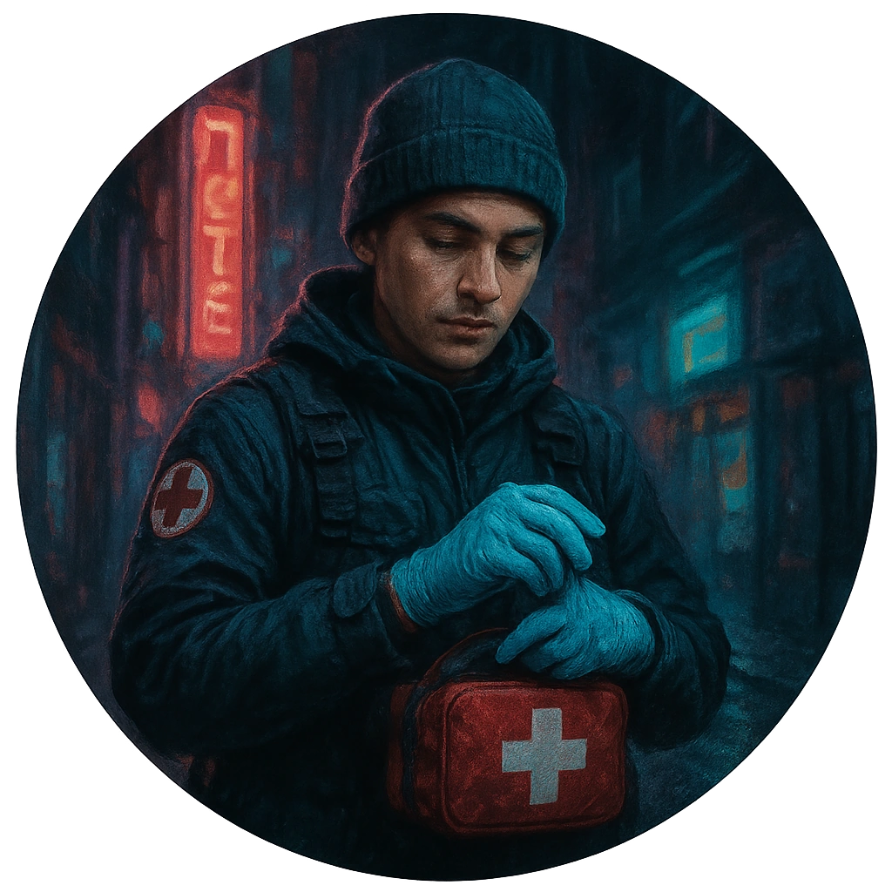

# Street Medic

A combat-capable medic patching up people the official system leaves to die.

<table class="stat-table">
  <thead><tr><th>Attribute</th><th align="right">Value</th></tr></thead>
  <tbody>
    <tr><td>Tier</td><td align="right">2</td></tr>
    <tr><td>Role</td><td align="right">Support</td></tr>
    <tr><td>Difficulty</td><td align="right">12</td></tr>
    <tr><td>Damage Thresholds</td><td align="right">4 / 7</td></tr>
    <tr><td>Hit Points</td><td align="right">5</td></tr>
    <tr><td>Stress</td><td align="right">2</td></tr>
  </tbody>
</table>

## Attack

| Attack | Modifier | Range | Damage |
|---|---:|---|---|
| Nerve Pinch | +2 | Close | d6 Physical |

## Experiences
- **Secure ongoing medical support +2**

## Motives & Tactics
Focuses on stabilizing others; will target aggressors' joints or nerves to end fights quickly.

## Features
—

## Notes
Has medical supplies, trauma knowledge, and dirt on who gets hurt where.

---

adversaries/Regular people (non-combatants)

