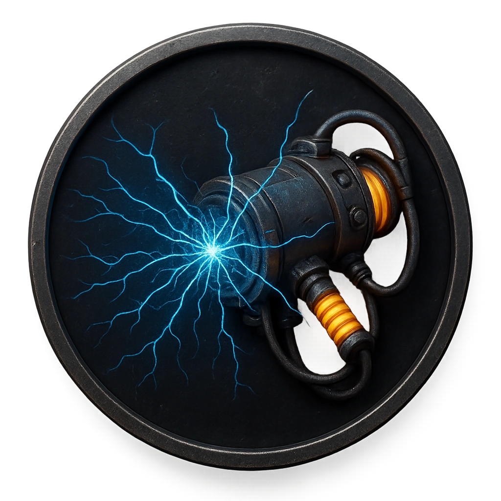

# Taser Web Launcher

A wall unit that fires electrified capture webs.

<table class="stat-table">
  <thead><tr><th>Attribute</th><th align="right">Value</th></tr></thead>
  <tbody>
    <tr><td>Tier</td><td align="right">1</td></tr>
    <tr><td>Role</td><td align="right">Support</td></tr>
    <tr><td>Difficulty</td><td align="right">10</td></tr>
    <tr><td>Damage Thresholds</td><td align="right">3 / 5</td></tr>
    <tr><td>Hit Points</td><td align="right">3</td></tr>
    <tr><td>Stress</td><td align="right">1</td></tr>
  </tbody>
</table>

## Attack

| Attack | Modifier | Range | Damage |
|---|---:|---|---|
| Web Shot | +2 | Close | d8 Physical |

## Experiences
- **Disarm firing coils +1**

## Motives & Tactics
Immobilize intruders before alerting security.

## Features
—

---

adversaries/Security devices/Support/Tier 1

