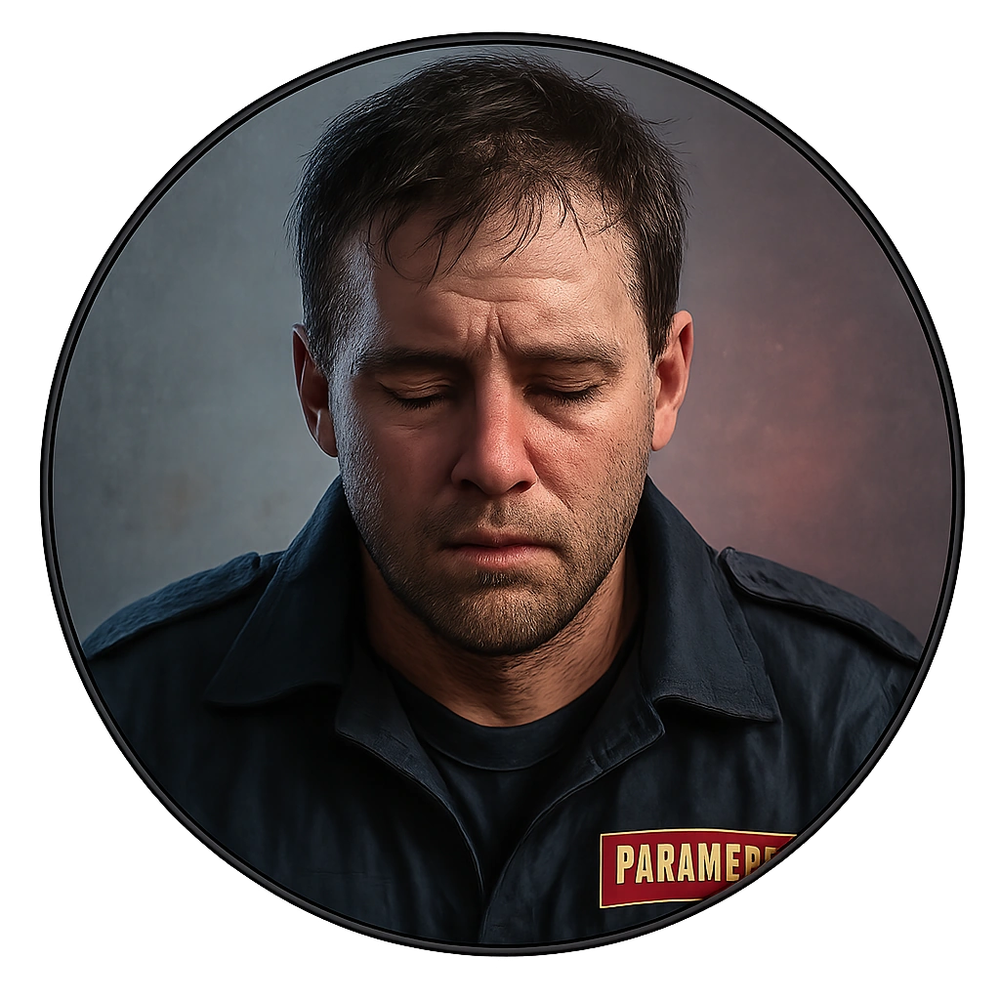

# Tired Paramedic on Break

A medic between calls, uniform rumpled and eyes red from too many nights on duty.

<table class="stat-table">
  <thead><tr><th>Attribute</th><th align="right">Value</th></tr></thead>
  <tbody>
    <tr><td>Tier</td><td align="right">1</td></tr>
    <tr><td>Role</td><td align="right">Support</td></tr>
    <tr><td>Difficulty</td><td align="right">10</td></tr>
    <tr><td>Damage Thresholds</td><td align="right">3 / 5</td></tr>
    <tr><td>Hit Points</td><td align="right">5</td></tr>
    <tr><td>Stress</td><td align="right">2</td></tr>
  </tbody>
</table>

## Attack

| Attack | Modifier | Range | Damage |
|---|---:|---|---|
| Stun Injector | +1 | Close | d6-1 Physical |

## Experiences
- **Gain field medical support +1**

## Motives & Tactics
Focuses on protecting the injured and avoiding casualties; only attacks to disable a direct threat.

## Features
—

## Notes
Carries basic medical gear and knows recent casualty hot spots.

---

adversaries/Regular people (non-combatants)

