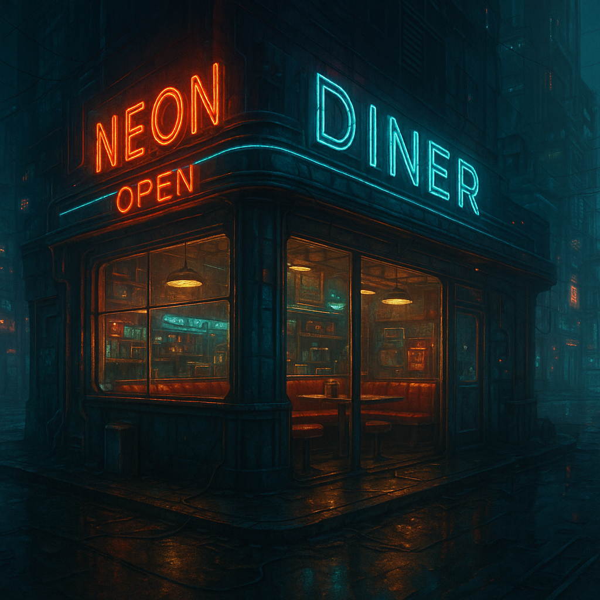

# Neon Diner Environment

(No description yet.)

<table class="stat-table">
  <thead><tr><th>Attribute</th><th align="right">Value</th></tr></thead>
  <tbody>
    <tr><td>Tier</td><td align="right">1</td></tr>
    <tr><td>Type</td><td align="right">Social</td></tr>
    <tr><td>Difficulty</td><td align="right">14</td></tr>
  </tbody>
</table>

## Impulses
- Safe zone
- good food
- comfortable
- peaceful

## Features
—

## Potential Adversaries
—

## Notes
System alert levels:

0

No alert – no action

1

No alert – no action

2

All ICE +1 Difficulty

3

All ICE +1 Difficulty and "Ma" glanced pointedly your way

4

A security drone is launched inside the diner

5

All ICE +2 damage and +2 Difficulty.  "Ma" comes over to your table.

6

You are kicked out of the diner by 'Ma' and banished for a week

---

environments/Tier 1

