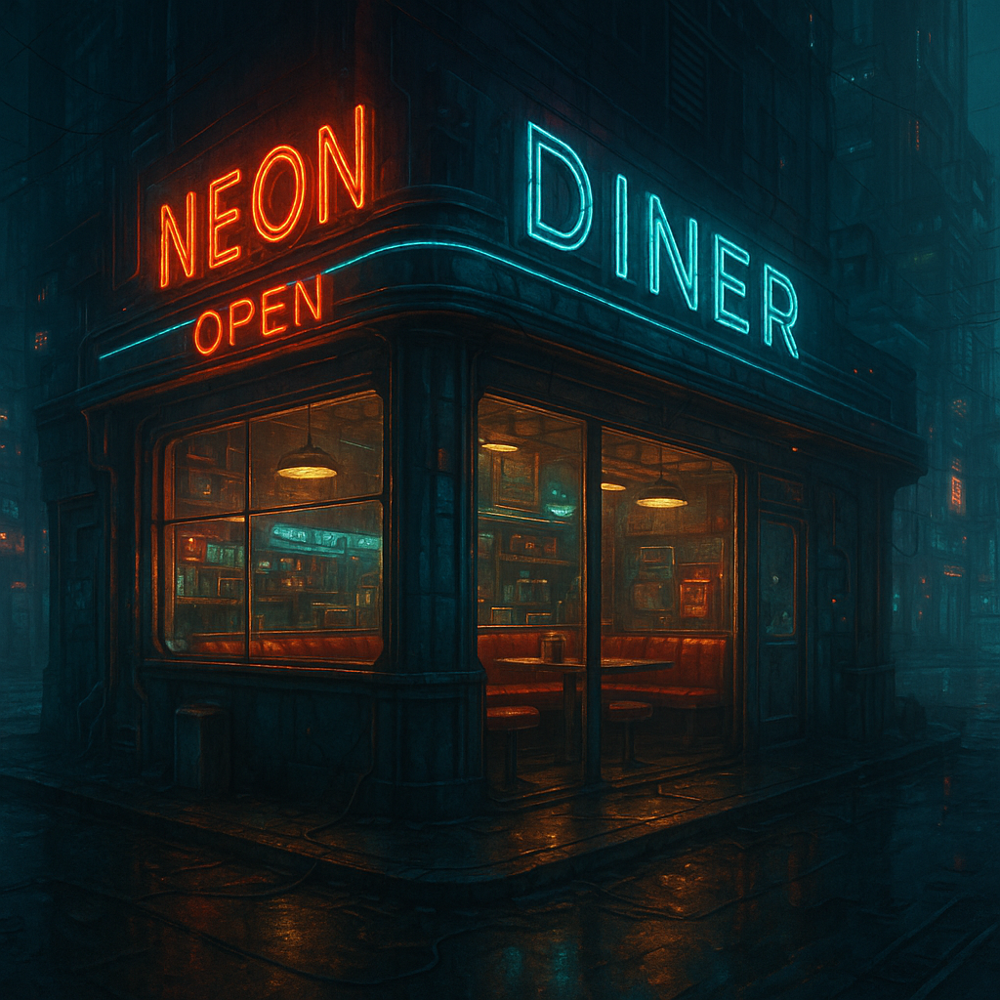

**Name:** *The Neon Diner*

### Background

The Neon Diner sits on the edge of South Verge, where the glow of the corporate skyline fades into the damp haze of forgotten industry. It’s an anachronism—a chrome-and-glass relic from the pre-Resonance era, when people still believed in breakfast specials and second chances. The sign out front flickers in three colors that never match, buzzing louder than the air recyclers, casting pink ghosts across the rain-slick street.

It survived when everything else around it didn’t. The old mag-rail line that used to feed the morning rush collapsed years ago, and the corporate blocks stopped sending inspectors once the gangs started charging tolls. The only reason the Diner’s still open is because it sits at the crossroads of half a dozen data-pipe access points—a neutral zone where you can grab synth-eggs, patch a signal, and trade information without getting fragged. The city runs on rumor, and *The Neon Diner* is one of its servers.

---

### The Owner: **Mara “Ma” Kuroda**

Mara Kuroda used to run logistics for OmniTrine back before the Resonance fried the company’s internal net. She lost everything—job, citizenship, family SIN—when she refused to sell out her crew to the corporate auditors. These days, she runs the diner like it’s a fortress: solid locks, good coffee, and an unspoken rule that business stays off the main floor.

She’s in her mid-60s now, with hair like polished steel and hands that still carry the calluses of someone who’s rebuilt their own generator more than once. Her left eye flickers faintly blue from an old datajack that never fully synced right, and she keeps a scattergun under the counter out of habit, not paranoia. Everyone in South Verge calls her *Ma*, though few remember her last name.

Runners, smugglers, and rogue AIs alike treat her with respect. If you cross her, you don’t just lose a meal—you lose your access to the one place in the Verge where the cameras don’t record and the walls don’t listen.

When the party walks in at 2 A.M., the place will be half-empty. A couple of long-haul drivers in the corner, a burned-out decker nursing a stim-cup, and Ma herself behind the counter, polishing the same mug she’s been holding since before the last economic collapse. She’ll take one look at them, size them up in a heartbeat, and grunt:

> “You’re late. Coffee’s strong, soup’s recycled, and your friend’s in the booth by the jukebox. Don’t bleed on the floor.”

*The Neon Diner* isn’t just a meeting spot—it’s a sanctuary, a digital neutral ground held together by Ma’s stubborn refusal to let the world erase her.

