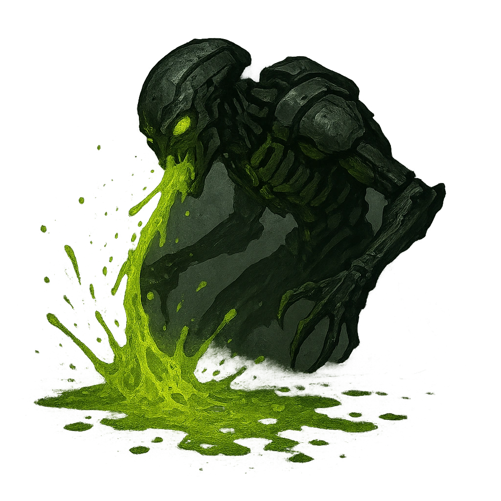

# Acid Bath

## Description
*
When the Burrower takes Severe damage, all creatures within Close range are bathed in their acidic blood, taking <strong>1d10</strong> physical damage. This splash covers the ground within Very Close range with blood, and all creatures other than the Burrower who move through it take <strong>1d6</strong> physical damage.

@Template[type:emanation|range:c]
*

## Actions
- 
**Splash** *c]*

- 
**Acid Ground** *This splash covers the ground within Very Close range with blood, and all creatures other than the Burrower who move through it take 1d6 physical damage.*

---

adversaries-features/Solo
 
**UUID:** `Compendium.cybermancy.system.acid-bath`

