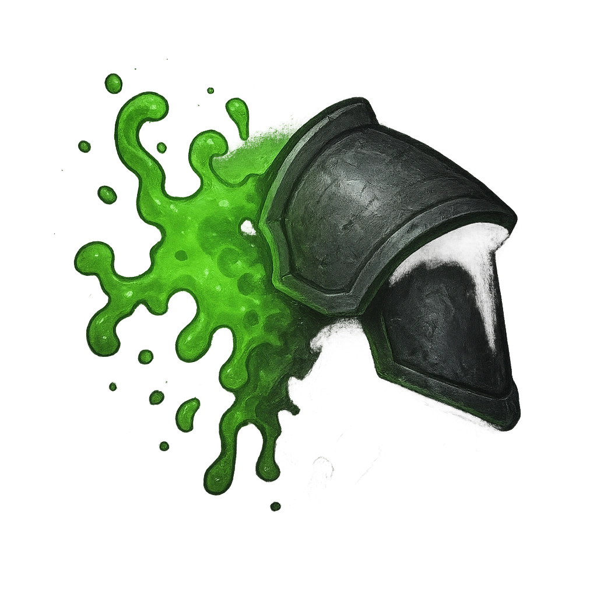

# Acidic Form

## Description
*
When the Ooze makes a successful attack, the target must mark an Armor Slot without receiving its benefits (they can still use armor to reduce the damage). If they can’t mark an Armor Slot, they must mark an additional HP.
*

## Actions
- 
**Damage Armor** *When the Ooze makes a successful attack, the target must mark an Armor Slot without receiving its benefits (they can still use armor to reduce the damage). If they can’t mark an Armor Slot, they must mark an additional HP.*

---

adversaries-features/Skulk
 
**UUID:** `Compendium.cybermancy.system.acidic-form`

