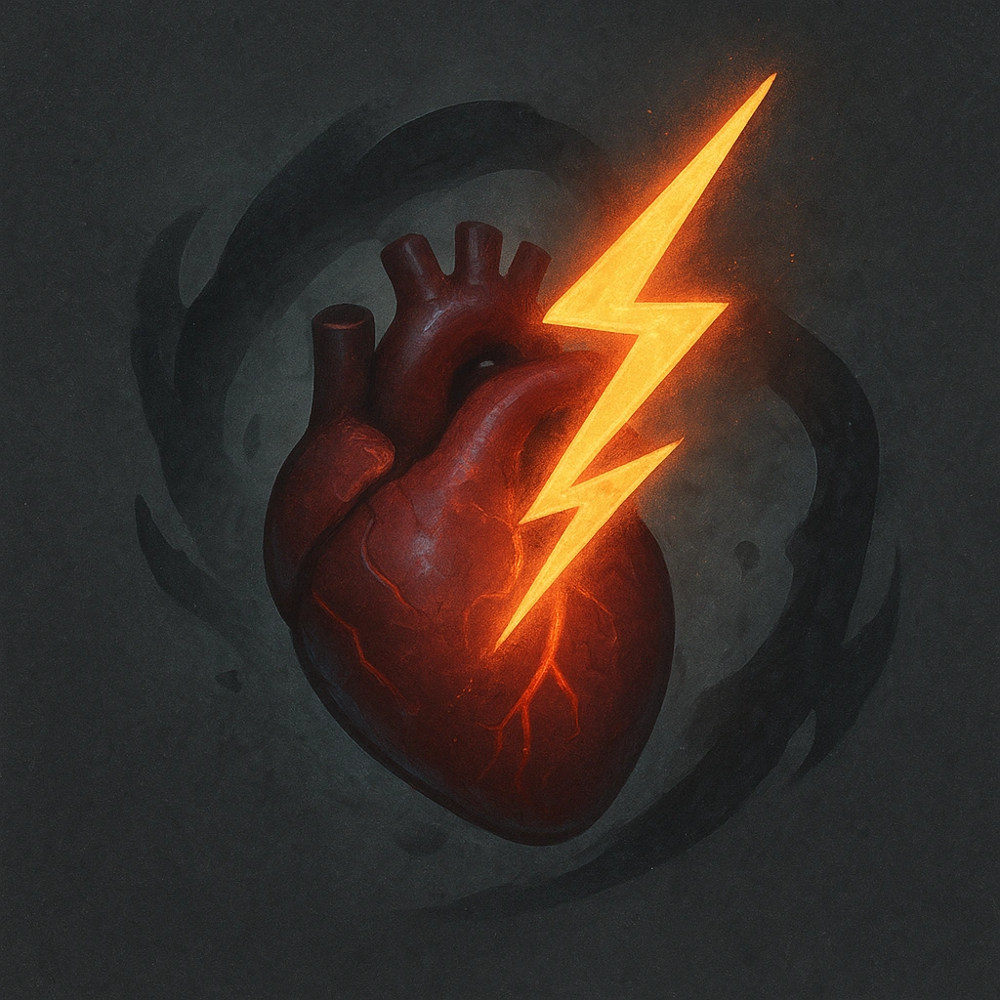

# Adrenaline Burst

## Description
*
Once per scene, spend a Fear to clear 2 HP and 2 Stress.
*

## Actions
- 
**Spend Fear** *Once per scene, spend a Fear to clear 2 HP and 2 Stress.*

---

adversaries-features/Bruiser
 
**UUID:** `Compendium.cybermancy.system.adrenaline-burst`

