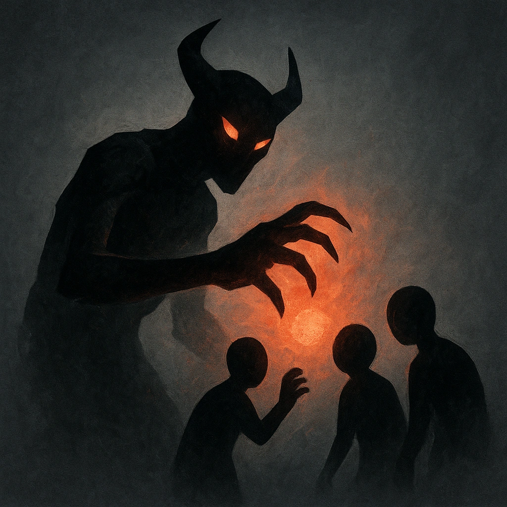

# All Must fall

## Description
*
When a PC rolls a failure with Fear while within Close range of the Demon, they lose a Hope.

@Template[type:emanation|range:c]
*

## Actions
- 
**Hope Damage** *c]*

---

adversaries-features/Solo
 
**UUID:** `Compendium.cybermancy.system.all-must-fall`

