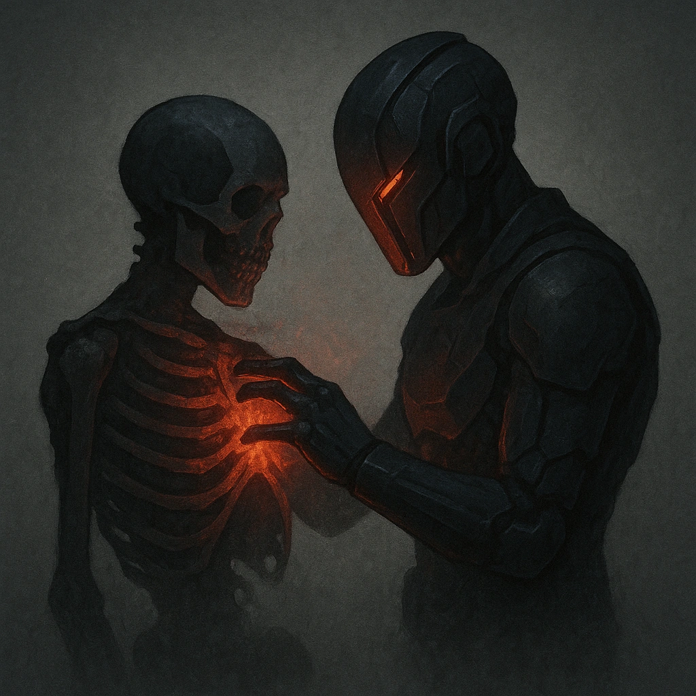

# Another for the Pile

## Description
*
When the Zombie is within Very Close range of a corpse, they can incorporate it into themselves, clearing a HP and a Stress.
*

## Actions
- 
**Heal** *When the Zombie is within Very Close range of a corpse, they can incorporate it into themselves, clearing a HP and a Stress.*

---

adversaries-features/Solo
 
**UUID:** `Compendium.cybermancy.system.another-for-the-pile`

