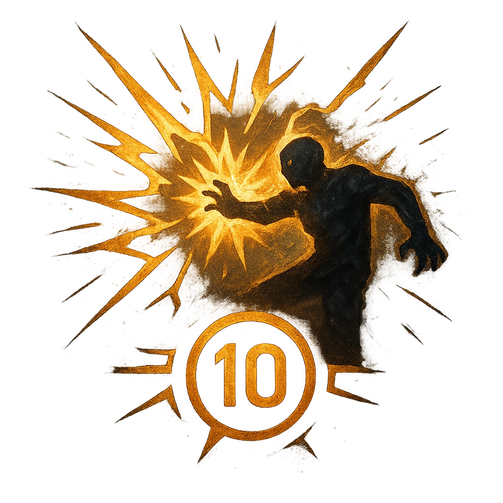

# Apocalyptic Thrasing

## Description
*
Countdown (1d12). <strong>Spend a Fear</strong> to activate. It ticks down when a PC rolls with Fear.

When it triggers, the Ashen Tyrant thrashes about, causing environmental damage (such as an earthquake, avalanche, or collapsing walls). All targets within Far range must make a Strength Reaction Roll. Targets who fail take 2d10+10 physical damage and are Restrained by the rubble until they break free with a successful Strength Roll. Targets who succeed take half damage. If the Ashen Tyrant is defeated while this countdown is active, trigger the countdown immediately as the destruction caused by their death throes.

@Template[type:emanation|range:f]
*

## Actions
- 
**Countdown** *Countdown (1d12). Spend a Fear to activate. It ticks down when a PC rolls with Fear.*

- 
**Roll Save** *f]*

---

adversaries-features/Solo
 
**UUID:** `Compendium.cybermancy.system.apocalyptic-thrasing`

