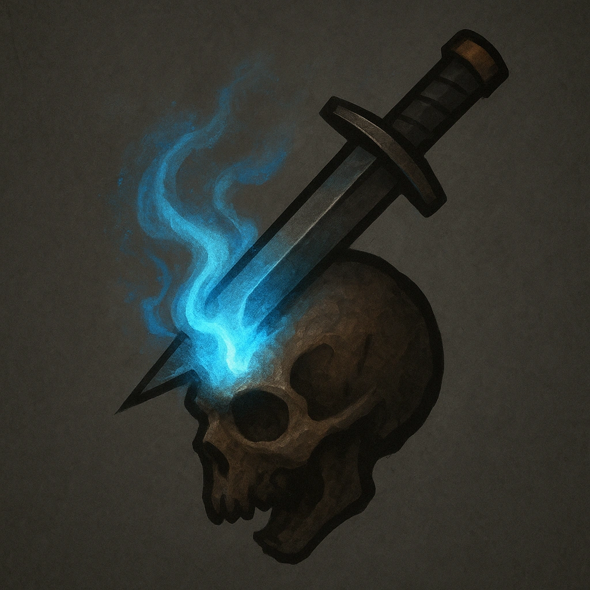

# Arcane Steel

## Description
*
Damage dealt by the Spellblade’s standard attack is considered both physical and magic.
*

## Actions
—

---

adversaries-features/Leader
 
**UUID:** `Compendium.cybermancy.system.arcane-steel`

