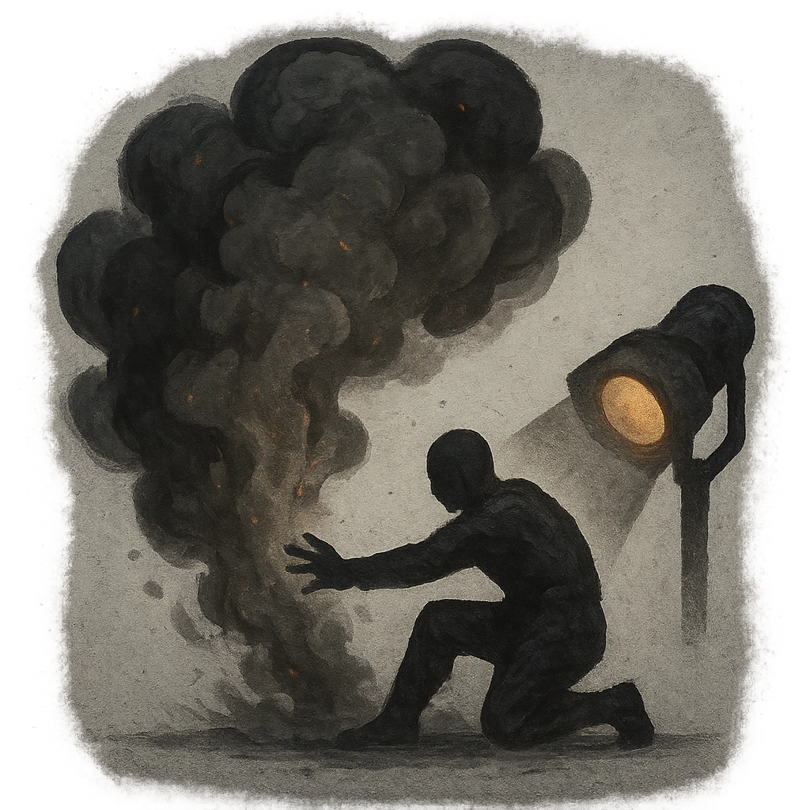

# Ashen Cloud

## Description
*
<strong>Spend a Fear</strong> to smash the ground and kick up ash within Far range. While within the ash cloud, a target has disadvantage on action rolls. The ash cloud clears the next time an adversary is spotlighted.

@Template[type:emanation|range:f]
*

## Actions
- 
**Spend Fear** *f]*

---

adversaries-features/Solo
 
**UUID:** `Compendium.cybermancy.system.ashen-cloud`

