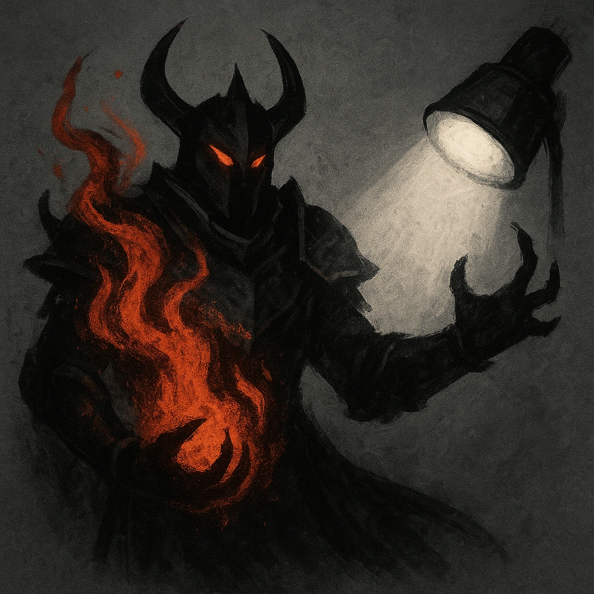

# Ashen Vengeance

## Description
*
When the Molten Scourge marks their last HP, replace them with the @UUID[Compendium.daggerheart.adversaries.Actor.pMuXGCSOQaxpi5tb]{Ashen Tyrant} and immediately spotlight them.
*

## Actions
—

---

adversaries-features/Solo
 
**UUID:** `Compendium.cybermancy.system.ashen-vengeance`

