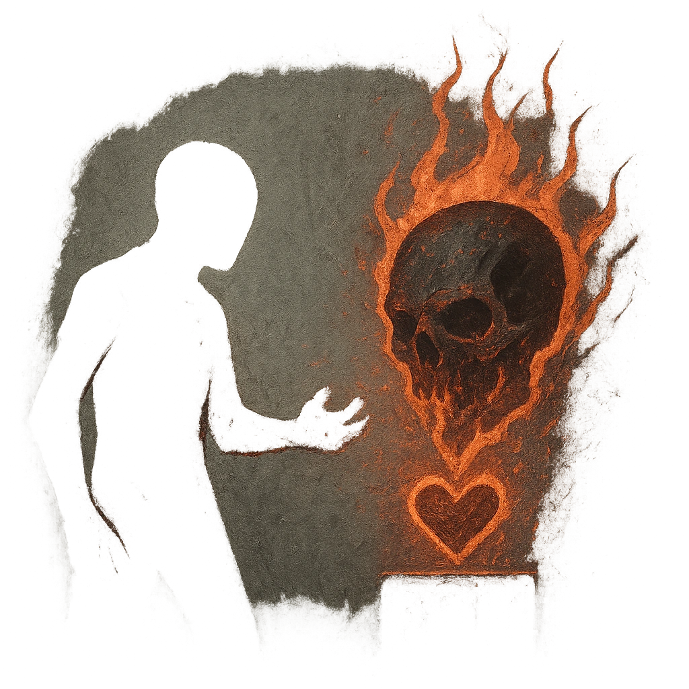

# Ashes to Ashes

## Description
*
When a PC rolls a failure while within Close range of the Ashen Tyrant, they lose a Hope and you gain a Fear. If the PC can’t lose a Hope, they must mark a HP.
*

## Actions
- 
**Lose Hope** *When a PC rolls a failure while within Close range of the Ashen Tyrant, they lose a Hope and you gain a Fear. If the PC can’t lose a Hope, they must mark a HP.*

---

adversaries-features/Solo
 
**UUID:** `Compendium.cybermancy.system.ashes-to-ashes`

