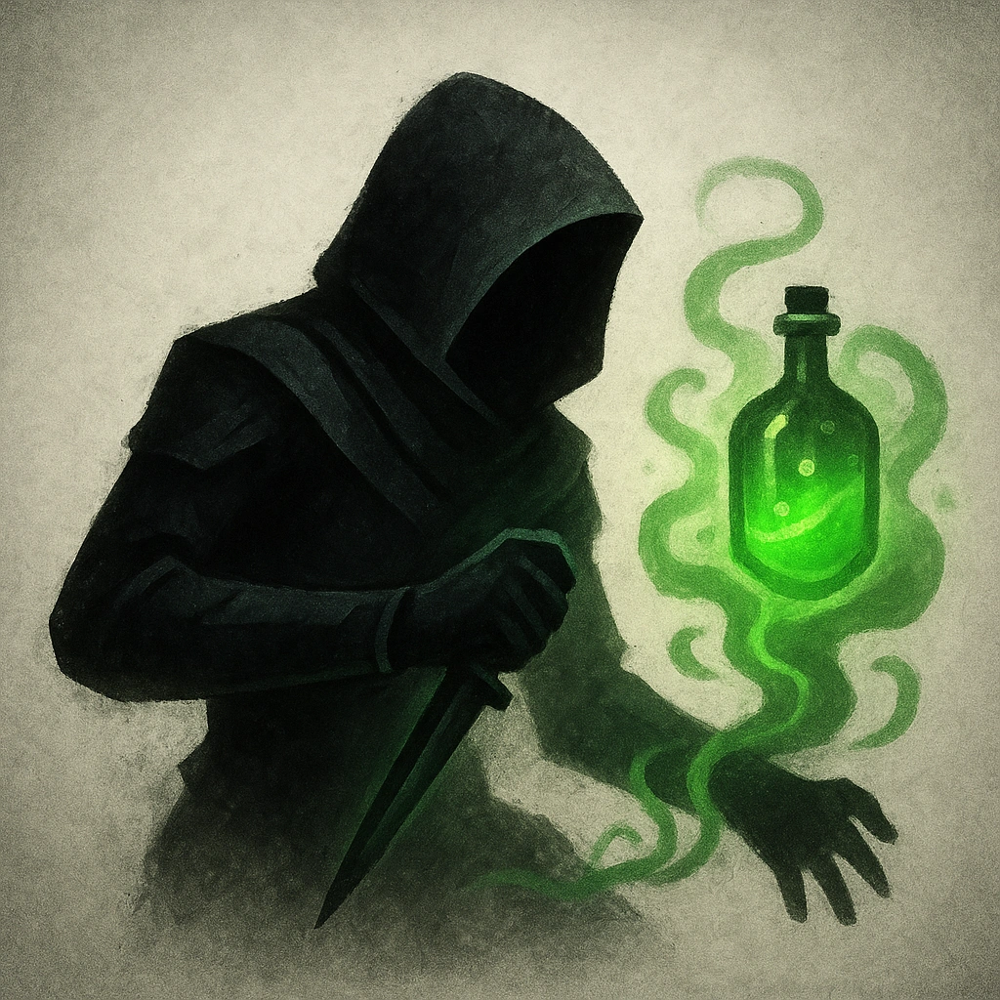

# Assassin Poisoner

## Description
*
The Assassin has advantage on attacks if they are <em>Hidden</em>.
*

## Actions
—

---

adversaries-features/Skulk
 
**UUID:** `Compendium.cybermancy.system.assassin-poisoner`

