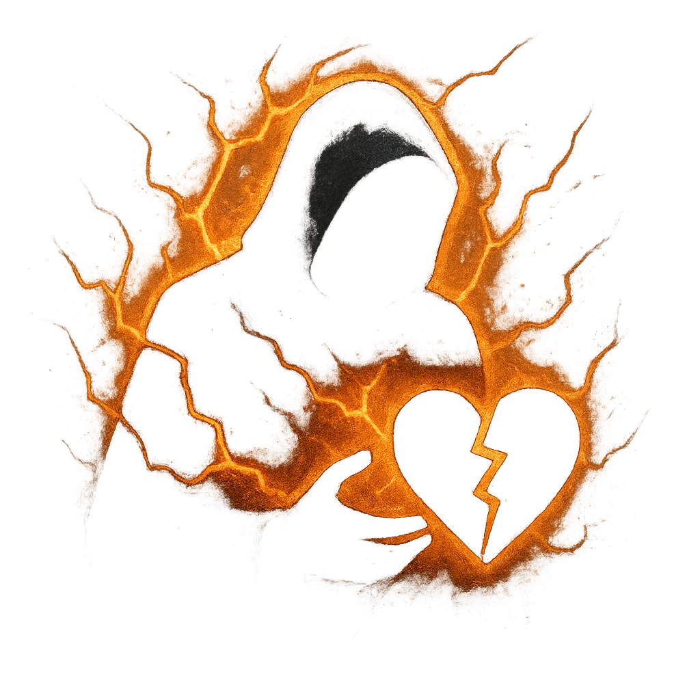

# Aura of Doom

## Description
*
When a PC marks HP from an attack by the Shock Troop, they lose a Hope.
*

## Actions
- 
**Lose Hope** **

---

adversaries-features/Minion
 
**UUID:** `Compendium.cybermancy.system.aura-of-doom`

