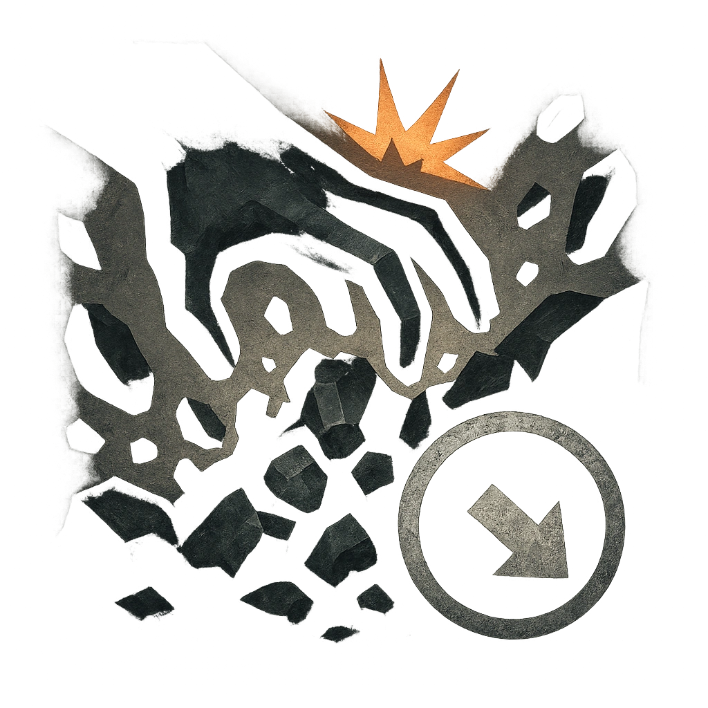

# Avalance Roar

## Description
*
<strong>Spend a Fear</strong> to roar while within a cave and cause a cave-in. All targets within Close range must succeed on an Agility Reaction Roll (14) or take <strong>2d10</strong> physical damage. The rubble can be cleared with a Progress Countdown (8).

@Template[type:emanation|range:c]
*

## Actions
- 
**Roll Save** *c]*

---

adversaries-features/Skulk
 
**UUID:** `Compendium.cybermancy.system.avalance-roar`

