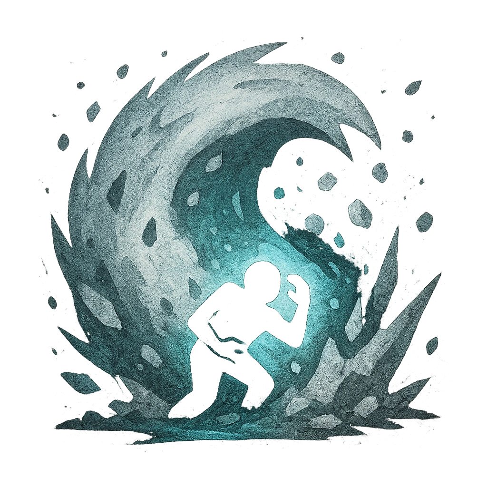

# Avalance

## Description
*
<strong>Spend a Fear</strong> to have the Dragon unleash a huge downfall of snow and ice, covering all other creatures within Far range. All targets within this area must succeed on an Instinct Reaction Roll or be buried in snow and rocks, becoming <em>Vulnerable</em> until they dig themselves out from the debris. For each PC that fails the reaction roll, you gain a Fear.

@Template[type:emanation|range:f]
*

## Actions
- 
**Attack** *f]*

---

adversaries-features/Solo
 
**UUID:** `Compendium.cybermancy.system.avalance`

