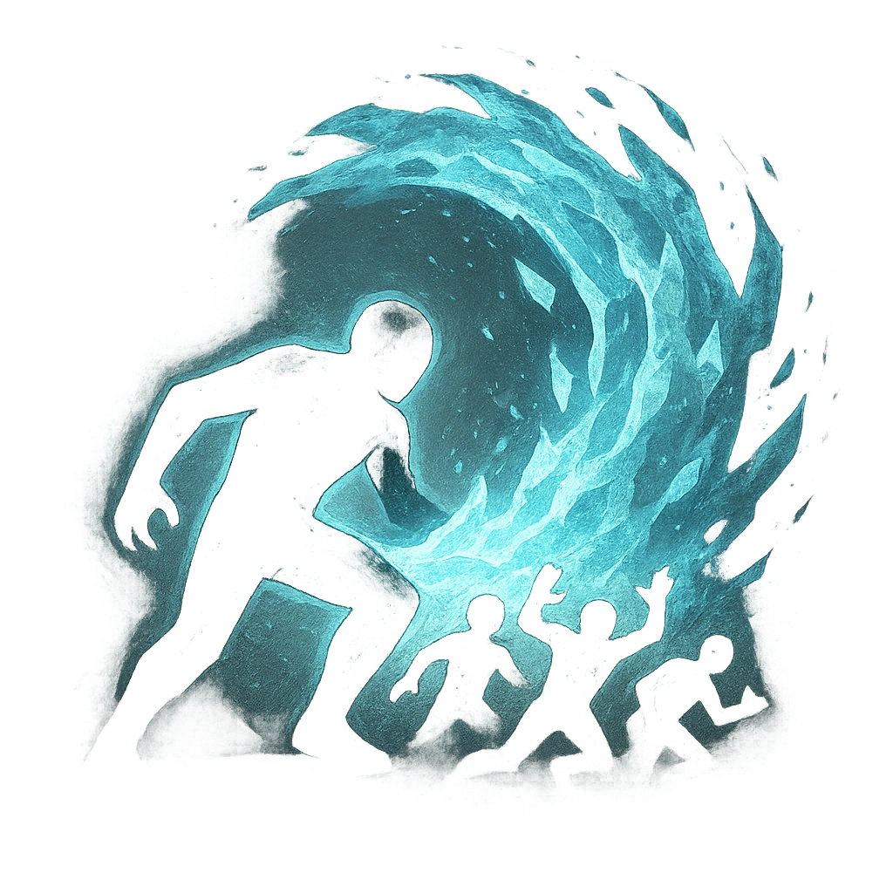

# Avalanche Tail

## Description
*
<strong>Mark a Stress</strong> to make an attack against all targets within Close range. Targets the Obsidian Predator succeeds against take <strong>4d6+4</strong> physical damage and are knocked.

@Template[type:emanation|range:c]
*

## Actions
- 
**Attack** *c]*

---

adversaries-features/Solo
 
**UUID:** `Compendium.cybermancy.system.avalanche-tail`

