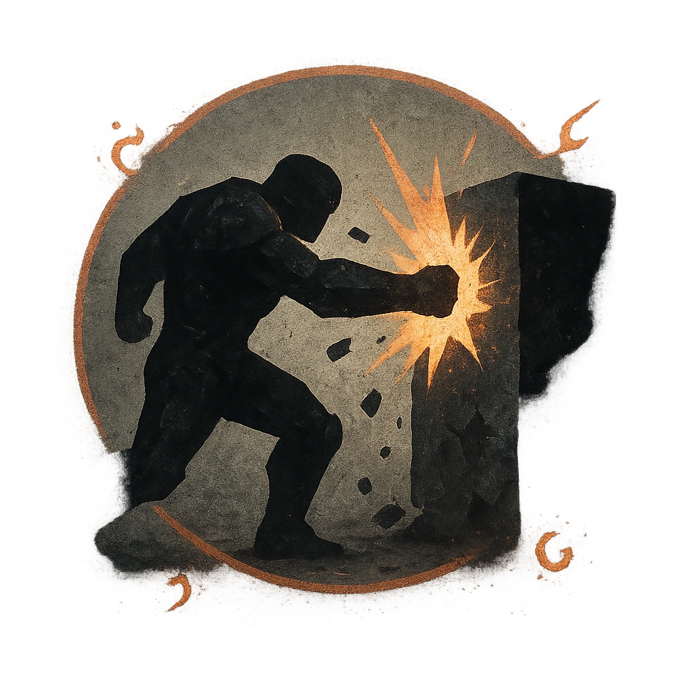

# Battering Ram

## Description
*
<strong>Mark a Stress</strong> to have the Brawler charge at an inanimate object within Close range they could feasibly smash (such as a wall, cart, or market stand) and destroy it. All targets within Very Close range of the object must succeed on an Agility Reaction Roll or take <strong>2d4+3</strong> physical damage from the shrapnel.

@Template[type:circle|range:vc]
*

## Actions
- 
**Roll Save** *vc]*

---

adversaries-features/Bruiser
 
**UUID:** `Compendium.cybermancy.system.battering-ram`

