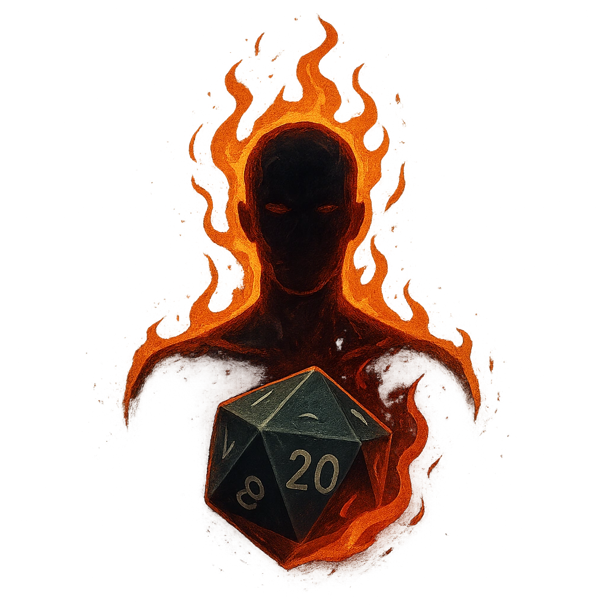

# Battle Lust

## Description
*
<strong>Spend a Fear</strong> to boil the blood of all PCs within Far range. They use a d20 as their Fear Die until the end of the scene.

@Template[type:emanation|range:f]
*

## Actions
- 
**Spend Fear** *f]*

---

adversaries-features/Bruiser
 
**UUID:** `Compendium.cybermancy.system.battle-lust`

